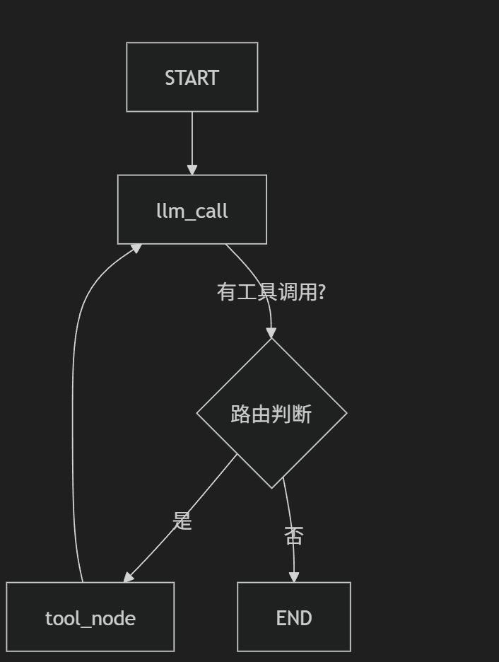

<!-- toc -->

[TOC]

# LangGraph Agent 入门指南

```python
"""LangGraph Agent 完整实现示例 (带详细注释版)

这份代码是一个完整的 LangGraph Agent 教程。
它展示了如何构建一个能够使用工具（加法、乘法）的 AI 代理。

核心概念：
1. **Nodes (节点)**: 代理的思考 (LLM) 和行动 (Tool) 单元。
2. **Edges (边)**: 定义流程的跳转逻辑。
3. **State (状态)**: 在节点间传递的数据，主要是消息历史。
"""

from __future__ import annotations
from typing import Annotated, Literal
from typing_extensions import TypedDict

# LangGraph 核心组件
# StateGraph: 用于构建状态图的类
# START, END: 特殊的图节点，分别代表流程的开始和结束
# MessagesState: 预定义的状态类型，自动处理消息列表的存储
from langgraph.graph import StateGraph, START, END, MessagesState
from langgraph.prebuilt import ToolNode

# LangChain 核心
from langchain_core.messages import HumanMessage, AIMessage, ToolMessage
from langchain_core.tools import tool


# ==================== 1. 定义工具 ====================
# 使用 @tool 装饰器将普通 Python 函数转换为 LangChain 可用的工具
@tool
def add(a: int, b: int) -> int:
    """加法工具：计算两个整数的和。
    
    Args:
        a: 第一个整数
        b: 第二个整数
    """
    result = a + b
    print(f"🔧 [行动] 调用加法工具: {a} + {b} = {result}")
    return result


@tool
def multiply(a: int, b: int) -> int:
    """乘法工具：计算两个整数的积。
    
    Args:
        a: 第一个整数
        b: 第二个整数
    """
    result = a * b
    print(f"🔧 [行动] 调用乘法工具: {a} * {b} = {result}")
    return result


# ==================== 2. 模拟 LLM ====================
# 在实际项目中，这里会使用 ChatOpenAI 或 ChatAnthropic
# 为了演示方便，我们手动实现一个简单的模拟 LLM
class MockLLM:
    """模拟的语言模型，用于测试流程而不消耗 API Token"""
    
    def __init__(self, tools):
        self.tools = tools
        self.call_count = 0
    
    def invoke(self, messages):
        """模拟 LLM 的思考过程"""
        self.call_count += 1
        last_message = messages[-1]
        
        print(f"\n🤖 [思考] LLM 第 {self.call_count} 次被调用")
        print(f"   输入消息: {last_message.content if hasattr(last_message, 'content') else str(last_message)[:50]}...")
        
        # 场景模拟：第一次调用，用户说 "Add 3 and 4"
        # LLM 应该决定调用 'add' 工具
        if self.call_count == 1 and isinstance(last_message, HumanMessage):
            # 简单的关键词匹配模拟理解能力
            if "add" in last_message.content.lower() or "3" in last_message.content:
                print("   👉 决策: 决定使用工具 'add'")
                return AIMessage(
                    content="", # 思维链内容通常放在这里，这里留空
                    tool_calls=[{
                        "name": "add",
                        "args": {"a": 3, "b": 4},
                        "id": "call_001" # 唯一的调用 ID
                    }]
                )
        
        # 场景模拟：第二次调用，收到了工具的运行结果
        # LLM 应该综合工具结果生成最终回答
        if self.call_count == 2:
            # 检查历史消息中是否有 ToolMessage
            tool_messages = [m for m in messages if isinstance(m, ToolMessage)]
            if tool_messages:
                result = tool_messages[-1].content
                print(f"   👉 决策: 收到工具结果 '{result}'，生成最终回答")
                return AIMessage(
                    content=f"计算完成！3 + 4 = {result}",
                    tool_calls=[]  # 任务完成，不再调用工具
                )
        
        # 默认兜底回复
        return AIMessage(content="我完成了任务。", tool_calls=[])


# ==================== 3. 定义节点函数 ====================
# 节点是图中的执行单元，接收当前状态，返回更新后的状态

def llm_call(state: MessagesState):
    """思考节点：调用 LLM 生成回复或工具调用请求"""
    print("\n📍 [节点] 进入 llm_call (思考阶段)")
    messages = state["messages"]
    
    # 调用 LLM
    response = mock_llm.invoke(messages)
    
    # 返回更新：LangGraph 会将这里的 'messages' 列表追加到全局状态中
    return {"messages": [response]}


def should_continue(state: MessagesState) -> Literal["tool_node", "__end__"]:
    """路由逻辑：决定下一步是执行工具还是结束"""
    messages = state["messages"]
    last_message = messages[-1]
    
    # 检查最后一条消息是否包含工具调用请求
    if hasattr(last_message, "tool_calls") and last_message.tool_calls:
        print(f"\n🔀 [路由] 检测到工具调用请求 -> 跳转到 'tool_node'")
        return "tool_node"
    
    print(f"\n🔀 [路由] 无工具调用 -> 流程结束 (END)")
    return END


# ==================== 4. 构建 Agent 图 ====================
print("=" * 60)
print("🏗️  正在构建 LangGraph Agent...")
print("=" * 60)

# (1) 准备工具列表
tools = [add, multiply]

# (2) 创建工具节点
# ToolNode 是 LangGraph 预置的节点，它能自动执行 tool_calls 并返回 ToolMessage
tool_node = ToolNode(tools)

# (3) 初始化模拟 LLM
mock_llm = MockLLM(tools)

# (4) 创建状态图构建器
# 使用 MessagesState 作为状态类型
agent_builder = StateGraph(MessagesState)

# (5) 添加节点
agent_builder.add_node("llm_call", llm_call)   # 思考节点
agent_builder.add_node("tool_node", tool_node) # 行动节点

# (6) 添加边 (定义流程)

# 起点 -> 思考
# 无论何时开始，总是先让 LLM 思考
agent_builder.add_edge(START, "llm_call")

# 思考 -> ? (条件跳转)
# 思考结束后，根据 should_continue 的结果跳转
agent_builder.add_conditional_edges(
    "llm_call",         #以此节点结束时触发
    should_continue,    # 路由函数
    {
        "tool_node": "tool_node",  # 函数返回 "tool_node" 时去这里
        END: END                   # 函数返回 END 时结束
    }
)

# 行动 -> 思考 (循环)
# 工具执行完后，必须回到 LLM 让他看结果
agent_builder.add_edge("tool_node", "llm_call")

# (7) 编译图
# 编译后的 agent 就是一个可调用的 Runnable 对象
agent = agent_builder.compile()

print("✅ Agent 构建完成！图结构已就绪。")


# ==================== 5. 运行测试 ====================
print("\n" + "=" * 60)
print("🧪 开始运行测试: 用户输入 'Add 3 and 4'")
print("=" * 60)

# 构造初始消息
messages = [HumanMessage(content="Add 3 and 4.")]

# 运行 Agent
# invoke 会触发图的执行，直到遇到 END
result = agent.invoke({"messages": messages})

print("\n" + "=" * 60)
print("📊 最终对话历史回顾")
print("=" * 60)

# 打印完整的对话历史
for i, m in enumerate(result["messages"], 1):
    role = "👤 用户" if isinstance(m, HumanMessage) else \
           "🤖 AI " if isinstance(m, AIMessage) else \
           "🔧 工具"
    
    content = m.content
    if isinstance(m, AIMessage) and m.tool_calls:
        content += f" [请求调用工具: {m.tool_calls[0]['name']}]"
    
    print(f"[{i}] {role}: {content}")

print("\n" + "=" * 60)
print("✅ 教程演示结束！")
print("=" * 60)
```

## 1.核心概念

langgraph是一个用于构建**有状态，多参与者**的应用程序的库，核心思想是将Agent的工作流看作是一个图

- 节点（Nodes）：执行具体工作的单元（例如：调用LLM，执行工具）
- 边（Edges）：定义节点之间的流向（例如：从LLM节点流向工具节点）
- 状态（State）：再节点之间传递懂得数据（例如：聊天记录Messages）



## 运行轨迹分析

当你运行 `python 2.py` 时，控制台会打印出每一步的决策过程。以下是一次完整的执行轨迹解析：

### 第一阶段：接收任务与初步思考

```
📍 [节点] 进入 llm_call (思考阶段)

🤖 [思考] LLM 第 1 次被调用

   👉 决策: 决定使用工具 'add'
```

- **解读**：用户输入 "Add 3 and 4"。LLM 分析后发现自己算不准（或者是被设定为必须用工具），于是生成了一个 `tool_calls` 请求。

### 第二阶段：路由与行动

```
🔀 [路由] 检测到工具调用请求 -> 跳转到 'tool_node'

🔧 [行动] 调用加法工具: 3 + 4 = 7
```

- 解读`should_continue` 函数看到了`tool_calls`，指挥流程走向`tool_node`工具执行后，结果`7`被封装成`ToolMessage`存入状态。

### 第三阶段：再次思考与完结

```
📍 [节点] 进入 llm_call (思考阶段)

🤖 [思考] LLM 第 2 次被调用

   👉 决策: 收到工具结果 '7'，生成最终回答

🔀 [路由] 无工具调用 -> 流程结束 (END)
```

- **解读**：LLM 看到了工具及工具的返回结果。它整合信息，生成自然语言回复 "计算完成！3 + 4 = 7"。路由函数检测到没有新的工具调用了，于是结束流程。


# Thinking in LangGraph

从构建一个个二处理客户支持邮件的AI代理出发

## 处理错误的类型

| 错误类型                               | 谁来修理它 | 处理方式                     | 何时使用                    |
| -------------------------------------- | ---------- | ---------------------------- | --------------------------- |
| 瞬态错误（网络问题，速率限制）         | 系统(自动) | 重试策略                     | 临时故障，通常在重试后解决  |
| LLM可恢复错误（工具错误，解析问题）    | LLM        | 将错误存储在状态中并循环返回 | LLM能够发现错误并调整其方法 |
| 用户可修正的错误(信息缺失，说明不清晰) | 人类       | 使用`interrupt()`暂停        | 需要用户输入才能继续        |
| 意外错误                               | 开发者     | 让其自然显露                 | 未知问题需要调试            |

# 第一个案例邮件Agent

```python
from typing import TypedDict, Literal
from langgraph.types import Command, RetryPolicy, interrupt
from langgraph.graph import StateGraph, START, END
from langchain_openai import ChatOpenAI
from langchain.messages import HumanMessage, AIMessage, ToolMessage
from langgraph.checkpoint.memory import MemorySaver
from langchain_ollama import ChatOllama
# ==========================================
# 1. 状态定义 (State Definitions)
# ==========================================

# 定义邮件分类的结构化输出 State
class EmailClassification(TypedDict):
    """Email分类的详细状态（被 LLM 输出所遵循的结构）"""
    intent: Literal["question", "bug", "billing", "feature", "complex"] # 意图
    urgency: Literal["low", "medium", "high", "critical"]             # 紧急程度
    topic: str                                                        # 主题
    summary: str                                                      # 摘要

# 定义整个 Agent 图运行时的全局 State
class EmailAgentState(TypedDict):
    """Email Agent 的全局状态，所有节点共享并修改这里的数据"""
    email_content: str
    sender_email: str
    email_id: str

    # 初始状态下，classification 为 None，由 classify_intent 节点填充
    classification: EmailClassification | None

    # 搜索结果，由 search_documentation 节点填充
    search_results: list[str] | None
    
    # 客户历史记录（代码主流程未挂载此节点，预留字段）
    customer_history: dict | None

    # 草稿回复，由 draft_response 节点填充，或由 human_review 修改
    draft_response: str | None
    
    # 消息列表，用于记录聊天上下文
    messages: list[str] | None


# ==========================================
# 2. 独立工具函数（未在主干 workflow 中使用，作为扩展参考）
# ==========================================

# 定义执行工具的函数 (通用模板)
# 注意：这里使用了 Command 对象，它可以同时返回状态的 Update 和下一步的 Goto 路由
def execute_tool(state: dict) -> Command[Literal["agent", "execute_tool"]]:
    """执行通用工具的示例节点"""
    try:
        result = run_tool(state['tool_call']) # 假设 run_tool 是外部函数
        return Command(update={"tool_result": result}, goto="agent")
    except Exception as e:
        return Command(
            update={"tool_result": f"Tool error: {str(e)}"},
            goto="agent"
        )

# 定义查询客户历史记录的函数 (展示了中断 interrupt 请求补充信息的用法)
def lookup_customer_history(state: dict) -> Command[Literal["draft_response", "lookup_customer_history"]]:
    """查询客户记录节点"""
    if not state.get('customer_id'):
        # 如果缺少 customer_id，触发中断，向外部请求输入
        user_input = interrupt({
            "messages": "Customer ID needed",
            "request": "Please provide the customer's account ID to look up their subscription history"
        })
        # 外部恢复(resume)后，更新 customer_id 并重新进入当前节点循环
        return Command(
            update={"customer_id": user_input['customer_id']},
            goto="lookup_customer_history" 
        )
    # 获取数据并进入下一步
    customer_data = fetch_customer_history(state['customer_id']) # 假设的外部函数
    return Command(update={"customer_history": customer_data}, goto="draft_response")


# ==========================================
# 3. 核心节点函数 (Nodes)
# ==========================================

# 初始化大语言模型
# llm = ChatOpenAI(model="gemini-3-pro-preview") # 注意：这里名称虽是 gemini，但包用的是 langchain_openai，需要确保你的 API 兼容
llm = ChatOllama(model="qwen2.5:1.5b", temperature=0)


def read_email(state: EmailAgentState) -> dict:
    """第一步：读取邮件，将其转化为人类消息存入全局状态"""
    return {
        "messages": [HumanMessage(content=f"Processing email: {state['email_content']}")]
    }

def classify_intent(state: EmailAgentState) -> Command[Literal["search_documentation", "human_review", "draft_response", "bug_tracking"]]:
    """第二步：使用 LLM 结构化输出对邮件进行意图和紧急度分类，并决定下一步去哪"""
    # 绑定结构化输出，强制 LLM 返回符合 EmailClassification 字典结构的数据
    structured_llm = llm.with_structured_output(EmailClassification)

    classification_prompt = f"""
    Analyze this customer email and classify it:

    Email: {state['email_content']}
    From: {state['sender_email']}

    Provide classification including intent, urgency, topic, and summary.
    """
    
    # 调用 LLM 获取分类结果
    classification = structured_llm.invoke(classification_prompt)

    # 【动态路由逻辑】根据分类结果，决定下一个节点 (goto)
    if classification['intent'] == 'billing' or classification['urgency'] == 'critical':
        goto = "human_review"      # 账单问题或致命紧急问题，直接转人工
    elif classification['intent'] in ['question', 'feature']:
        goto = "search_documentation" # 问题咨询或需求建议，去搜文档
    elif classification['intent'] == 'bug':
        goto = "bug_tracking"      # Bug 报告，去建工单
    else:
        goto = "draft_response"    # 其他情况，直接写草稿回复

    # 返回 Command，一并完成 State 更新和图跳转
    return Command(
        update={"classification": classification},
        goto=goto
    )

def search_documentation(state: EmailAgentState) -> Command[Literal["draft_response"]]:
    """处理节点：搜索知识库（Mock数据）"""
    classification = state['classification']
    query = f"{classification['intent']} {classification.get('topic', '')}"

    try:
        # 模拟搜索知识库的结果
        search_results = [
            "Reset password via Settings > Security > Change Password",
            "Password must be at least 12 characters",
            "Include uppercase, lowercase, numbers, and symbols"
        ]
    except Exception as e: # 替换了未定义的 SearchAPIError
        search_results = [f"Search temporarily unavailable: {str(e)}"]

    # 将搜索结果存入状态，并跳转去写草稿
    return Command(
        update={"search_results": search_results},
        goto="draft_response"
    )

def bug_tracking(state: EmailAgentState) -> Command[Literal["draft_response"]]:
    """处理节点：创建 Bug 工单"""
    ticket_id = "BUG-12345" # 模拟工单号

    # 更新搜索结果（这里用作上下文传递），并跳转去写草稿
    return Command(
        update={
            "search_results": [f"Bug ticket {ticket_id} created"],
        },
        goto="draft_response"
    )

def draft_response(state: EmailAgentState) -> Command[Literal["human_review", "send_reply"]]:
    """第三步：综合所有上下文（文档、分类），生成回复草稿，并评估质量"""
    classification = state.get('classification', {})

    # 组装上下文段落
    context_sections = []
    if state.get('search_results'):
        formatted_docs = "\n".join([f"- {doc}" for doc in state['search_results']])
        context_sections.append(f"Relevant documentation:\n{formatted_docs}")

    if state.get('customer_history'):
        context_sections.append(f"Customer tier: {state['customer_history'].get('tier', 'standard')}")

    # 构建写作 Prompt
    draft_prompt = f"""
    Draft a response to this customer email:
    {state['email_content']}

    Email intent: {classification.get('intent', 'unknown')}
    Urgency level: {classification.get('urgency', 'medium')}

    {chr(10).join(context_sections)}

    Guidelines:
    - Be professional and helpful
    - Address their specific concern
    - Use the provided documentation when relevant
    """

    # 调用 LLM 生成草稿
    response = llm.invoke(draft_prompt)
    
    # 【二次路由逻辑】判断是否需要人工审核
    needs_review = (
        classification.get('urgency') in ['high', 'critical'] or
        classification.get('intent') == 'complex'
    )
    
    goto = "human_review" if needs_review else "send_reply"

    return Command(
        update={"draft_response": response.content},
        goto=goto
    )

def human_review(state: EmailAgentState) -> Command[Literal["send_reply"]]:
    """第四步：人工审核节点（包含断点机制）"""
    classification = state.get('classification', {})

    # 【核心！】interrupt 会在这里抛出异常暂停图的执行，并将括号内的数据传给外部调用者。
    # 当外部调用者使用 app.invoke(Command(resume=...)) 恢复图时，
    # interrupt 的返回值 human_decision 就会接收到那个 resume 的字典。
    human_decision = interrupt({
        "email_id": state.get('email_id', ''),
        "original_email": state.get('email_content', ''),
        "draft_response": state.get('draft_response', ''),
        "urgency": classification.get('urgency'),
        "intent": classification.get('intent'),
        "action": "Please review and approve/edit this response"
    })

    # 根据人工在断点恢复时传入的决策 (human_decision) 进行处理
    if human_decision.get("approved"):
        return Command(
            # 如果人工审批通过，检查人工有没有修改草稿，如果有修改就用修改后的，没有就用原草稿
            update={"draft_response": human_decision.get("edited_response", state.get('draft_response', ''))},
            goto="send_reply"
        )
    else:
        # 实际业务中，如果不通过可能会 goto="draft_response" 重写，这里演示都流向 send_reply
        return Command(
            update={"draft_response": human_decision.get("edited_response", state.get('draft_response', ''))},
            goto="send_reply"
        )

def send_reply(state: EmailAgentState) -> dict:
    """最终步：发送邮件（仅打印）"""
    print(f"Sending reply: {state['draft_response'][:100]}...")
    return {}


# ==========================================
# 4. 构建状态图 (Graph Routing)
# ==========================================
workflow = StateGraph(EmailAgentState)

# 添加所有节点
workflow.add_node("read_email", read_email)
workflow.add_node("classify_intent", classify_intent)
workflow.add_node("bug_tracking", bug_tracking)
workflow.add_node("draft_response", draft_response)
workflow.add_node("human_review", human_review)
workflow.add_node("send_reply", send_reply)

# 添加带重试机制的节点 (清理了你原代码中重复添加的部分)
workflow.add_node(
    "search_documentation",
    search_documentation,
    retry_policy=RetryPolicy(
        max_attempts=3,      # 最大尝试次数
        initial_interval=1.0 # 重试间隔
    )
)

# 【核心！】因为很多节点返回了 Command 对象直接指定了 goto 跳转目的地，
# 所以这里不需要像旧版 LangGraph 那样画复杂的 add_edge 和 add_conditional_edges。
# 只需要定义起始和结束边即可。
workflow.add_edge(START, "read_email")
workflow.add_edge("read_email", "classify_intent")
# (classify_intent 会通过 Command 返回 goto 去向其他节点)
# ...中间节点的连线由返回的 Command(goto=...) 动态接管...
workflow.add_edge("send_reply", END)

# 设置记忆检查点（Checkpointer，必须有它才能使用 interrupt 功能）
memory = MemorySaver()

# 编译生成可运行的应用 (修正了原代码的 complie 拼写错误)
app = workflow.compile(checkpointer=memory)


# ==========================================
# 5. 测试运行 (Testing the Agent)
# ==========================================
print("\n--- 第一阶段：接收邮件并处理到断点 ---")
initial_state = {
    "email_content": "I was charged twice for my subscription! This is urgent",
    "sender_email": "customer@example.com",
    "email_id": "gdyl_001",
    "messages": []
}

# 需要一个独一无二的 thread_id 来追踪这个具体的任务/对话实例
config = {"configurable": {"thread_id": "gdyl_001"}}

# 第一次运行：因为邮件包含 "urgent" 和 "charged twice" (billing)，
# 图会流转 classify_intent -> human_review，然后在 human_review 处遇到 interrupt 暂停停下。
result = app.invoke(initial_state, config)

# 此时，返回的 result 中会包含 interrupt 抛出的信息供前端展示给审批人
print(f"\n[人工审核中断信息]: \n{result['__interrupt__']}")

print("\n--- 第二阶段：人工完成审核，恢复运行 ---")
# 人工审查了信息，构造一条恢复命令 (resume)
human_response = Command(
    resume={
        "approved": True,
        "edited_response": "We sincerely apologize for the double charge. I've initiated an immediate refund..."
    }
)

# 第二次运行：将用户的指令（通过 Command 包装）传回给图。
# 图会加载 thread_id='gdyl_001' 的历史状态，从刚刚 interrupt 的代码下一行继续执行。
final_result = app.invoke(human_response, config)

print("\n[流程结束]")


--- 第一阶段：接收邮件并处理到断点 ---

[人工审核中断信息]: 
[Interrupt(value={'email_id': 'gdyl_001', 'original_email': 'I was charged twice for my subscription! This is urgent', 'draft_response': '', 'urgency': 'high', 'intent': 'billing', 'action': 'Please review and approve/edit this response'}, id='2cd8b3f14a9f59e0e95f0e230c96e880')]

--- 第二阶段：人工完成审核，恢复运行 ---
Sending reply: We sincerely apologize for the double charge. I've initiated an immediate refund......

[流程结束]
```

