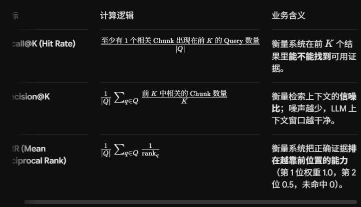

<!-- toc -->

[TOC]

## Evaluate

- Recall@k: 衡量系统在前 K 个结果里能不能找到可用证据
- Percision@K: 衡量检索上下文的**信噪比**；噪声越少，LLM 上下文窗口越干净。
- MRR(Mean Reciprocal Rank):衡量系统把正确证据**排在越靠前位置的能力**（第 1 位权重 1.0，第 2 位 0.5，未命中 0）。

