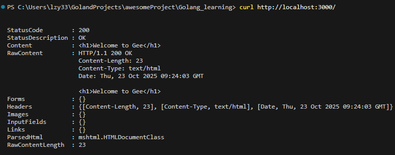
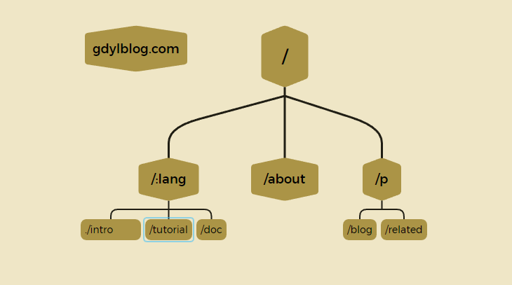
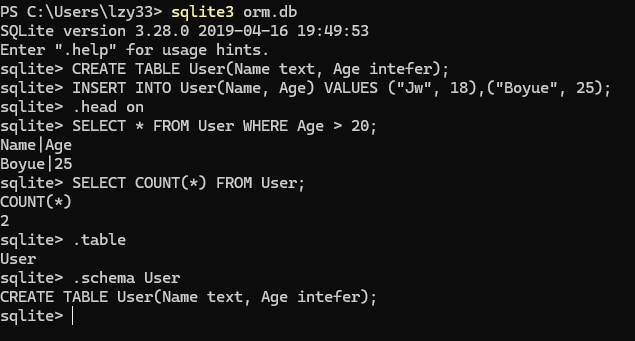

<!-- toc -->

[TOC]

# Web Gee

## HTTP基础与上下文


- **context**：封装`*http.Request`和`http.ResponseWriter`，以及解析动态路由，中间件。

  Context随着每一个请求的出现而产生，请求的结束而销毁，和当前i请求强相关的信息都应当由Context承载

- **router**：

​		



​					

​					


## Trie树（前缀树）



每一段可作为前缀树的一个节点，通过树结构查询，如果中间某一层的节点都不满足条件，那么就说明没有匹配到的路由，查询结束

动态路由实现一下两个功能。

- 参数匹配`:`.例如 `/p/:lang/doc`，可以匹配 `/p/c/doc` 和 `/p/go/doc`
- 通配`*`.例如 `/static/*filepath`，可以匹配`/static/fav.ico`，也可以匹配`/static/js/jQuery.js`，这种模式常用于静态服务器，能够递归地匹配子路径。

### 注册与匹配

开发服务时，注册路由规则，映射handler； 访问时，匹配路由规则

**插入**：递归查找每一层的节点，如果没有匹配到当前`part`节点，则新建一个，有一点需要注意，`/p/:lang/doc`只有在第三层节点，即`doc`节点，`pattern`才会设置为`/p/:lang/doc`。`p`和`:lang`节点的`pattern`属性皆为空。因此，当匹配结束时，我们可以使用`n.pattern == ""`来判断路由规则是否匹配成功。例如，`/p/python`虽能成功匹配到`:lang`，但`:lang`的`pattern`值为空，因此匹配失败。

**查询**：递归查询每一层的节点，退出规则为，匹配到`*`,匹配失败，或是匹配到了第`len(parts)`层节点

## 分组控制

路由分组

- 以`/post`开头的路由匿名可访问
- 以`/admin`开头的路由需要鉴权
- 以`/api`开头的路由是RESTful接口,可以对接第三方平台，需要第三方平台鉴权


## 中间件(middleware)

非业务的技术类组件

- 插入点在哪？使用框架的人并不关心底层逻辑的具体实现，如果插入点太底层，中间件逻辑就会非常复杂。如果插入点离用户太近，那和用户直接定义一组函数，每次在Handler中手工调用没有多大的优势了
- 中间件的输入是什么？中间件的输入，决定了扩展能力。暴露的参数太少，用户发挥空间有限

具体实现步骤：

路由组调用`Use`添加中间件到路由中

`engine.ServeHTTP` 先按照分组前缀把匹配的中间件依次塞进 [c.handlers](vscode-file://vscode-app/d:/Vs Code/Microsoft VS Code/resources/app/out/vs/code/electron-browser/workbench/workbench.html)，`router.handle` 再把最终业务 `Handler` 追加到链尾，随后 [c.Next()](vscode-file://vscode-app/d:/Vs Code/Microsoft VS Code/resources/app/out/vs/code/electron-browser/workbench/workbench.html) 驱动整条链，以“洋葱模型”方式按顺序执行前置逻辑、到内核处理器、再回溯执行后置逻辑


# Cache

## LRU


- 蓝色的为字典(map),存储键和值的映射关系，这样根据某个键(key)查找对应的值(value)的复杂是`O(1)`,在字典中插入一条记录的复杂度也是`O(1)`
- 红色的双向链表(double linked list)实现的队列，将所有的值放到双向链表中，当访问到某个值时，将其移动到队尾的复杂度`O(1)`，在队尾新增一条记录以及删除一条巨鹿的复杂的均为`O(1)`

## 支持并发读写

抽象一个制度数据结构`ByteView`用来表示缓存值

```go
//Getter 是用户提供的数据源抽象：当缓存未命中时，框架通过该接口获取源数据
type Getter interface {
	Get(key string) ([]byte, error)
}

// 允许直接传入一个函数作为 Getter，便于测试和使用
type GetterFunc func(key string) ([]byte, error)

// Get 实现了 Getter 接口，使得任意符合签名的函数都能作为 Getter 使用
func (f GetterFunc) Get(key string) ([]byte, error) {
	return f(key)
}
```

- 定义接口Getter和回调函数`Get(key string) ([]byte, error)`，参数是key，返回值为`[]byte`
- 定义函数类型 GetterFunc，并实现 Getter 接口的 `Get` 方法。
- 函数类型实现某一个接口，称之为接口型函数，方便使用者在调用时既能够传入函数作为参数，也能够传入实现了该接口的结构体作为参数。
- 任何一个形如`func(key string) ([]byte, error)`的普通函数，只要使用`GetterFunc()`一包，就自动变成了一个实现了Getter接口的对象
- 接口 -> 方法 -> 函数

定义了一个接口 `Getter`，只包含一个方法 `Get(key string) ([]byte, error)`，紧接着定义了一个函数类型 `GetterFunc`，GetterFunc 参数和返回值与 Getter 中 Get 方法是一致的。而且 GetterFunc 还定义了 Get 方式，并在 Get 方法中调用自己，这样就实现了接口 Getter。所以 GetterFunc 是一个实现了接口的函数类型，简称为接口型函数。

## 一致性哈希

一致性哈希算法将key映射到 2^32 的空间中，将这个数字首尾相连，形成一个环

- 计算节点/机器（通常使用节点的名称，编号和IP地址）的哈希值，放置在环上
- 计算key的哈希值，放置在环上，顺时针寻找到第一个节点，就是应选取的节点/机器

一致性哈希算法，在新增/删除节点时，只需要重新定位该节点附近的一小部分数据，而不需要重新定位所有的节点，这就解决了上述的问题


## 分布式节点

```
使用一致性哈希选择节点        是                                    是
    |-----> 是否是远程节点 -----> HTTP 客户端访问远程节点 --> 成功？-----> 服务端返回返回值
                    |  否                                    ↓  否
                    |----------------------------> 回退到本地节点处理。
```


```go
package main

import (
	"cache"
	"flag"
	"fmt"
	"log"
	"net/http"
)

var db = map[string]string{
	"jw":    "114",
	"boyue": "514",
	"Sam":   "567",
}

func createGroup() *cache.Group {
	return cache.NewGroup("test", 2<<10, cache.GetterFunc(
		func(key string) ([]byte, error) {
			log.Println("[SlowDB] search key", key)
			if v, ok := db[key]; ok {
				return []byte(v), nil
			}
			return nil, fmt.Errorf("%s not exist", key)
		}))
}

// startCacheServer 启动缓存服务器
func startCacheServer(addr string, addrs []string, g *cache.Group) {
	peers := cache.NewHTTPPool(addr)
	peers.Set(addrs...)

	g.RegisterPeers(peers)

	log.Println("cache is running at", addr)
	log.Fatal(http.ListenAndServe(addr[7:], peers))

}

// startAPIServer 启动一个 API 服务器，供用户访问
func startAPIServer(apiAddr string, g *cache.Group) {
	http.Handle("/api", http.HandlerFunc(
		func(w http.ResponseWriter, r *http.Request) {
			key := r.URL.Query().Get("key")
			view, err := g.Get(key)
			if err != nil {
				http.Error(w, err.Error(), http.StatusInternalServerError)
				return
			}
			w.Header().Set("Content-Type", "application/octet-stream")
			w.Write(view.ByteSlice())
		}))
	log.Println("fontend server is running at", apiAddr)
	log.Fatal(http.ListenAndServe(apiAddr[7:], nil))
}

func main() {
	var port int
	var api bool
	flag.IntVar(&port, "port", 8001, "Cache server port")
	flag.BoolVar(&api, "api", false, "start api server")
	flag.Parse()

	apiAddr := "http://localhost:4000"

	addrMap := map[int]string{
		8001: "http://localhost:8001",
		8002: "http://localhost:8002",
		8003: "http://localhost:8003",
	}

	var addrs []string
	for _, v := range addrMap {
		addrs = append(addrs, v)
	}

	g := createGroup()
	if api {
		go startAPIServer(apiAddr, g)
	}
	startCacheServer(addrMap[port], addrs, g)
}

```


### 详细访问流程

curl 请求 `http://localhost:4000/api?key=jw`

- `startAPIServer` 注册的 handler 得到请求，取出 query 的 `key=jw`调用 `g.Get("jw")`。
- 从这里开始就进入 `cache.Group` 的逻辑。

当执行 startAPIServer 中的 g.Get(key)时候

1. Group.get(key)先查本地缓存，如若没有在向这peer求

   - `g.mainCache.get("jw")` 找本地 LRU；命中直接返回，这样就会马上给客户端输出数据。

   - miss 时调用 `g.load("jw")`：

     1. 如果之前 `RegisterPeers` 成功，`peer := g.peer.PickPeer("jw")` 会用一致性哈希挑一个“负责 jw” 的缓存节点。若选到的不是自己，就调用 `g.getFromPeer(peer, "jw")` 。

     2. `getFromPeer` 内部调用 `peer.Get(group, key)`，这里的 `peer` 实际是刚才 `Set`时创建的。

        `httpGetter`：

        - 会拼好 URL：`{peer地址}/_cache/{group}/{key}`，发 `http.Get`。
        - 对方节点的 `HTTPPool.ServeHTTP `收到后重复同样流程（先查本地缓存，miss 就回源）

     3. 如果没有 peer（单节点）或 peer 获取失败，则退回 `g.getLocally("jw")`，由之前传入的 `GetterFunc` 从 `db` map 查数据，并放入自己本地缓存。

​				

## 防止缓存击穿

### 缓存雪崩

缓存在同一时刻全部失效，造成顺势DB请求量大，压力剧增，引起雪崩。缓存雪崩通常因为缓存服务器宕机，缓存的key设置了相同的过期时间等引起

### 缓存击穿

一个存在的key，在缓存过期的那一刻，同时有大量的请求，这些请求都会击穿到DB，造成顺势DB请求量大，压力剧增

### 缓存穿透

查询一个不存在的数据，因为不存在则不会写到缓存中，所以每次都会去请求DB，如果瞬间流量过大，穿透到DB，导致宕机

## Go Protobuf

# 反射

- `reflect.Type`：描述类型（结构体，名称，方法集合等）

- `reflect.Value`：描述值（实际存储的数据，可读写，调用方法等）

| 概念               | 说明                                                         |
| ------------------ | ------------------------------------------------------------ |
| `Type`             | 静态类型信息，零值不可修改                                   |
| `Value`            | 动态值容器，可以读取/修改（需满足可设置条件）                |
| `Kind`             | 具体种类（结构体、指针、切片、map、接口、函数等），由 `Type.Kind()` 得到 |
| `Elem()`           | 对指针 / 切片 / 数组 / map / chan 类型，拿到其元素类型       |
| `Indirect(v)`      | 如果 v 是指针，就返回其指向的值；如果不是指针，原样返回（对接 ORM 场景很常用） |
| “可设置”(Settable) | 只有地址可达且可导出的字段才可以被修改（unexported 字段会跳错误或 panic） |


# ORM

对象关系映射（Object Relational Mapping）是通过使用描述对象和数据库之间映射的元数据，将面向对象语言程序中的对象自动持久化到关系数据库中



## Hook机制

Hook，钩子，提前在可能增加功能的地方埋好（预设）一个钩子，当我们需要重新修改或者增加这个地方的逻辑的时候，把扩展的类或者方法挂载到这个点即可。

```go
// CallMethod 调用注册在模型或当前传入对象上的 Hook 方法（通过反射）
func (s *Session) CallMethod(method string, value interface{}) {
    // 在test中  s.RefTable().Model 返回 指针 *Account{}
    //MethodByName 返回与给定名称的方法对应的函数值。
    fm := reflect.ValueOf(s.RefTable().Model).MethodByName(method)
	// tmp := &fm
	// log.Info(fmt.Sprintf("call method: %s, tmp: %v", method, tmp))
	if value != nil {
		fm = reflect.ValueOf(value).MethodByName(method)
	}
	
    // Hook 约定只接收一个参数（*Session）。接收者（*Account）由反射自动绑定。
	param := []reflect.Value{reflect.ValueOf(s)}

	//确认方法存在才调用。
	if fm.IsValid() {
		//fm.Call(param) 执行：隐式把接收者设为 value（或 s.RefTable().Model），显式参数是 s。
 		//`Call` 函数会调用函数 `fm`，并将输入参数 `param` 传递给它。
		if v := fm.Call(param); len(v) > 1 {
			if err, ok := v[1].Interface().(error); ok {
				log.Error(err)
			}
		}
	}
	return
}
```

## 事务

### 事务的ACID属性

- 原子性（Atomicity）：事务中的全部操作在数据库中是不可分割的，要么全部完成，要么全部不执行
- 一致性（Consistency）：几个并行执行的事务，其执行结果必须与按某一顺序串行执行的结果相一致
- 隔离性（Isolation）：事务的执行不受其他事务的干扰，事务执行的中间结果对其他事务必须是透明的
- 持久性（Durability）：对于任意已提交事务，系统必须保证事务对数据库的改变不被丢失，即使数据库出现故障

```go
// Transaction 在事务中执行回调 f：
// - 开始事务
//	遇到 return f(s)：先求值 f(s)，得到 (res, e)。
//	将结果赋给命名返回值 result、err。
//	进入所有已登记的 defer（逆序执行）。
//	defer 结束后，使用命名返回值离开函数。
func (engine *Engine) Transaction(f TxFunc) (result interface{}, err error) {
	s := engine.NewSession()

	if err := s.Begin(); err != nil {
		return nil, err
	}
	defer func() {
		if p := recover(); p != nil {
			_ = s.Rollback()
			panic(p) // - 若发生 panic：先回滚，再将 panic 重新抛出；
		} else if err != nil {
			_ = s.Rollback() // - 若发生错误：回滚事务；
		} else {
			err = s.Commit() // - 否则：提交事务。
		}
	}()
	return f(s)
}
```

