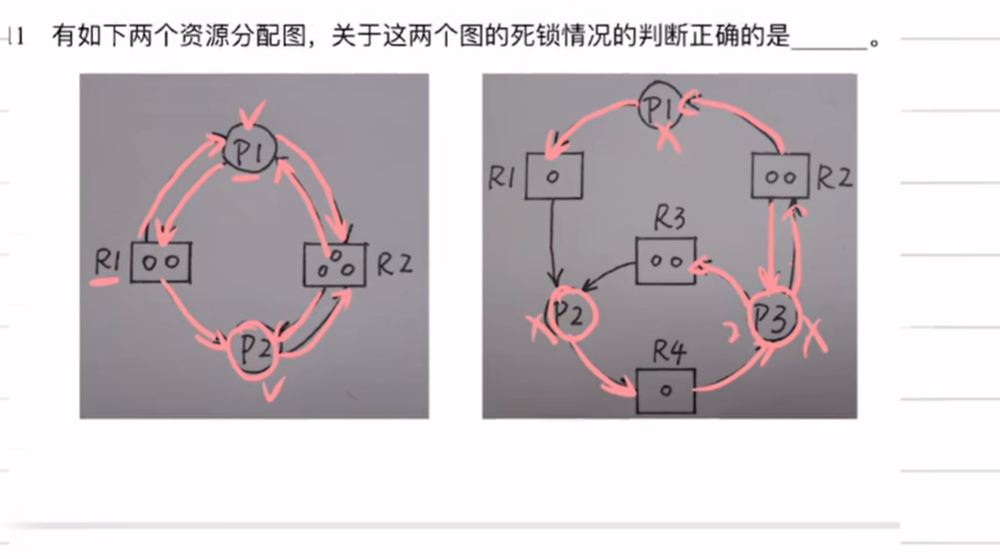
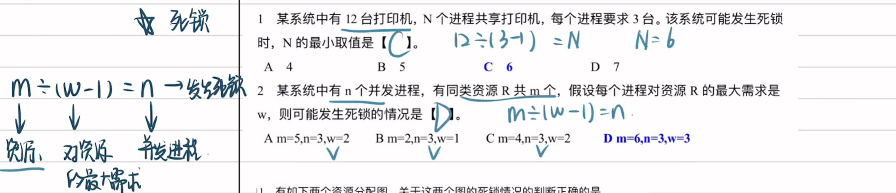
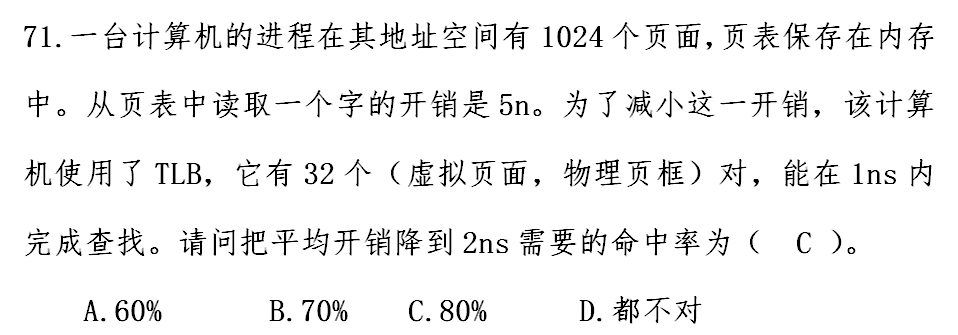
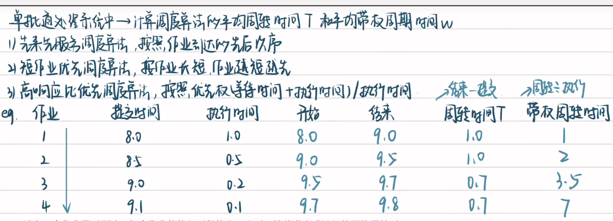
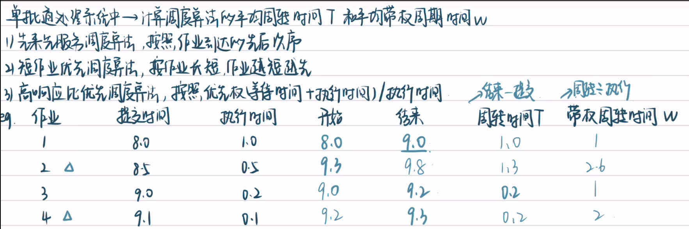
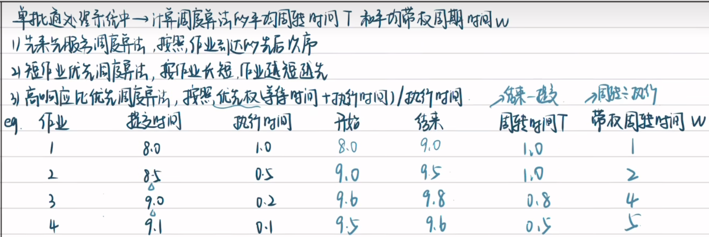
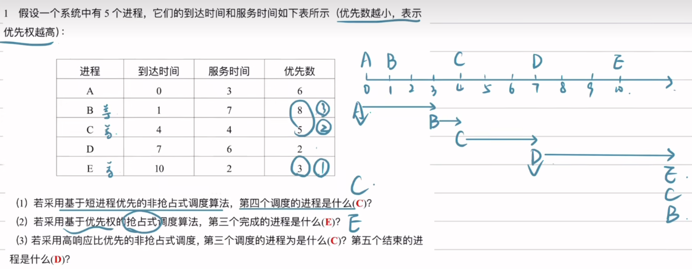
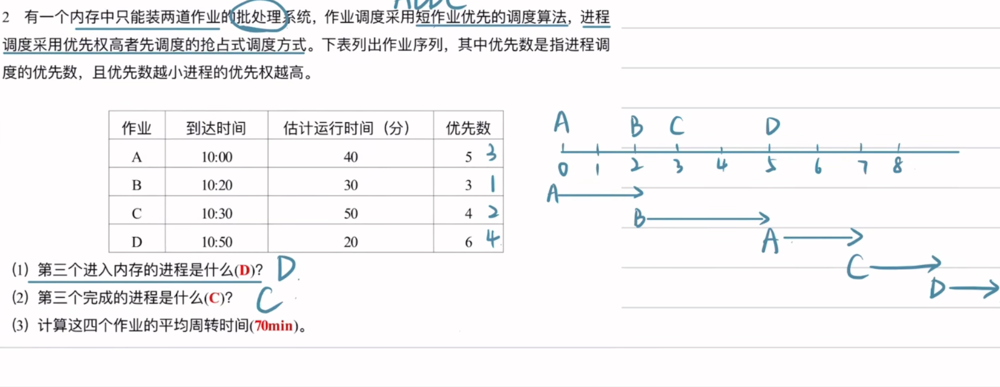
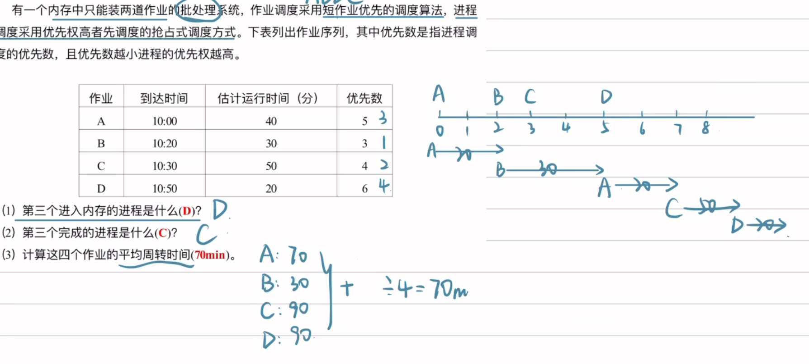
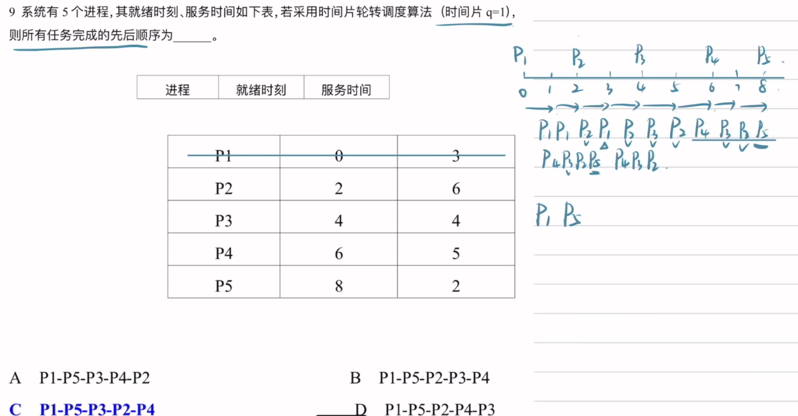

<!-- toc -->

[TOC]

## 操作系统概览

- 同一时间间隔是并发，同一时刻是并行

## 进程管理

## 内存管理

## 雨课堂

- **时间片轮转算法** ：每个进程依次获得时间片运行，若未完成则重新排队。
- **最长响应时间** ：最后一个被调度的进程的等待时间最长。
  最坏情况下，该进程需等待前面所有进程各执行一个时间片。
  计算公式：(*n*−1)×时间片，其中 *n* 为进程数。
  代入数据：(10−1)×5ms=45ms。

- 银行家算法核心公式 

  Need[*i*,*j*]=Max[*i*,*j*]−Allocation[*i*,*j*]

  其中，Need表示进程还需多少资源才能完成任务。

- 死锁避免条件 

  确保至少有一个进程能完成，从而释放资源供其他进程使用。

  计算公式：

  最少资源数=*n*×(单进程最大需求−1)+1

  代入数据：

  3×(4−1)+1=10

- 死锁预防 

  通过破坏死锁的四个必要条件之一（互斥、请求保持、不可抢占、循环等待）来避免死锁。

  - **有序资源分配法** ：按序申请资源，破坏“循环等待”条件，属于预防策略。
  - **银行家算法** ：属于死锁避免策略。
  - **死锁检测法** ：属于死锁检测与恢复策略。
  - **资源分配图化简法** ：用于检测死锁是否存在。

## 选择题

*E**A**T*=TLB命中率×(TLB访问时间)+(1−TLB命中率)×(TLB访问时间+页表访问时间)

题中给出的参数如下：

- TLB访问时间 = 1ns
- 页表访问时间 = 5ns
- 要求的平均访问时间（EAT）= 2ns

将这些值代入公式：

2=*h*×1+(1−*h*)×(1+5)2=*h*×1+(1−*h*)×62=*h*+6−6*h*2=6−5*h*5*h*=4*h*=0.8

## 大题速成

- 先来先服务（FCFS）

- 短作业优先调度算法（SJF）

- 高响应比优先调度算法（HRRN，Highest Response Ratio Next)

​	响应比 =（等待时间 + 服务时间）÷ 服务时间

​	每次调度时计算各就绪进程响应比，选择响应比最高的进程运行，且进程一旦运行就不被抢占，直到完成。

（开始时间 - 提交时间 + 执行时间) / 执行时间 

- 优先级调度算法（PS Priority Scheduling）

第三问：

具体分析过程

1. **0 时刻**：进程 A 到达，此时就绪队列只有 A，A 投入运行。A 的服务时间为 3，3 时刻结束。
2. 3 时刻
   - 进程 B 在 1 时刻已到达，等待时间为 3 - 1 = 2；进程 C 在 4 时刻到达，此时还未到达，不参与此次调度；进程 D 在 7 时刻到达，此时还未到达，不参与此次调度；进程 E 在 10 时刻到达，此时还未到达，不参与此次调度。
   - 计算 B 的响应比：`(2 + 7)÷7 ≈ 1.29` ，所以 B 投入运行。B 的服务时间为 7，10 时刻结束。
3. 10 时刻
   - 进程 C 在 4 时刻到达，等待时间为 10 - 4 = 6；进程 D 在 7 时刻到达，等待时间为 10 - 7 = 3；进程 E 在 10 时刻到达，等待时间为 0。
   - 计算 C 的响应比：`(6 + 4)÷4 = 2.5` ；计算 D 的响应比：`(3 + 6)÷6 = 1.5` ；计算 E 的响应比：`(0 + 2)÷2 = 1` 。
   - 因为 C 的响应比最高，所以第三个调度的进程是 C 。C 服务时间为 4，14 时刻结束。
4. 14 时刻
   - 进程 D 等待时间为 14 - 7 = 7；进程 E 等待时间为 14 - 10 = 4。
   - 计算 D 的响应比：`(7 + 6)÷6 ≈ 2.17` ；计算 E 的响应比：`(4 + 2)÷2 = 3` 。E 响应比高，E 投入运行，E 服务时间为 2，16 时刻结束。
5. **16 时刻**：只剩下进程 D，D 投入运行，D 服务时间为 6，22 时刻结束，所以第五个结束的进程是 D 。

第二问：第三个完成的进程是什么

1. **10:20 - 10:50**：进程 B 到达后，因其优先数（3）小于 A（5），抢占运行并于 10:50 完成，成为**第一个完成**的进程。
2. **10:50 - 11:00**：B 完成后，A 继续运行剩余 10 分钟（40 - 30 = 10），于 11:00 完成，成为**第二个完成**的进程。
3. **11:00**：A 完成后，内存空出一个位置，作业 C（10:30 到达，等待中）进入内存。此时内存中有 D（10:50 进入，未运行）和 C。进程调度比较优先数，C（4）小于 D（6），C 抢占运行。C 估计运行 50 分钟，从 11:00 开始，于 11:50 完成，成为**第三个完成**的进程。

- 时间片轮转调度算法（RR Round Robin）

1. **0 - 1**：P1 运行，服务时间剩 2，排入队尾。
2. **2 - 3**：P1 再次运行，服务时间剩 1，排入队尾；P2 就绪加入队列。
3. **3 - 4**：P2 运行，服务时间剩 5，排入队尾。
4. **4 - 5**：P1 运行，服务时间耗尽，**P1 完成**；P3 就绪加入队列。
5. **5 - 6**：P2 运行，服务时间剩 4，排入队尾。
6. **6 - 7**：P3 运行，服务时间剩 3，排入队尾；P4 就绪加入队列。
7. **7 - 8**：P2 运行，服务时间剩 3，排入队尾。
8. **8 - 9**：P4 运行，服务时间剩 4，排入队尾；P5 就绪加入队列。
9. **11 - 12**：P5 运行，服务时间剩 1，排入队尾。
10. **15 - 16**：P5 运行，服务时间耗尽，**P5 完成**。
11. **17 - 18**：P3 运行，服务时间耗尽，**P3 完成**。
12. **18 - 19**：P2 运行，服务时间耗尽，**P2 完成**。
13. **20 - 21**：P4 运行，服务时间耗尽，**P4 完成**。

综上，所有任务完成的先后顺序为 P1-P5-P3-P2-P4，答案选 **C**。

