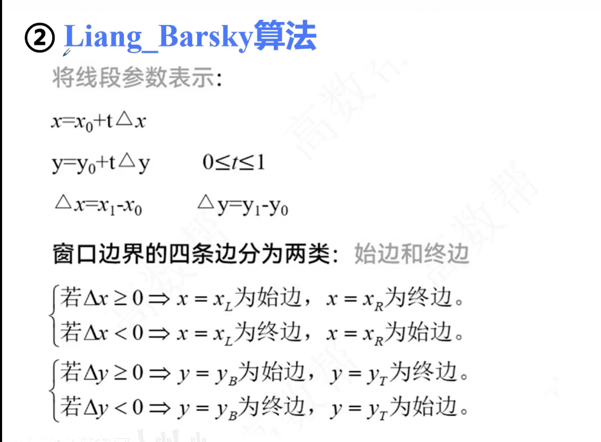
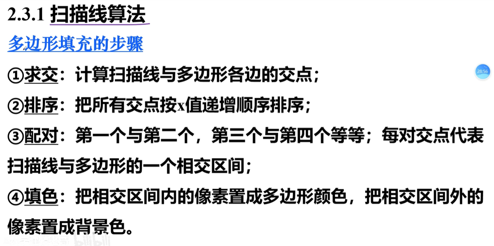
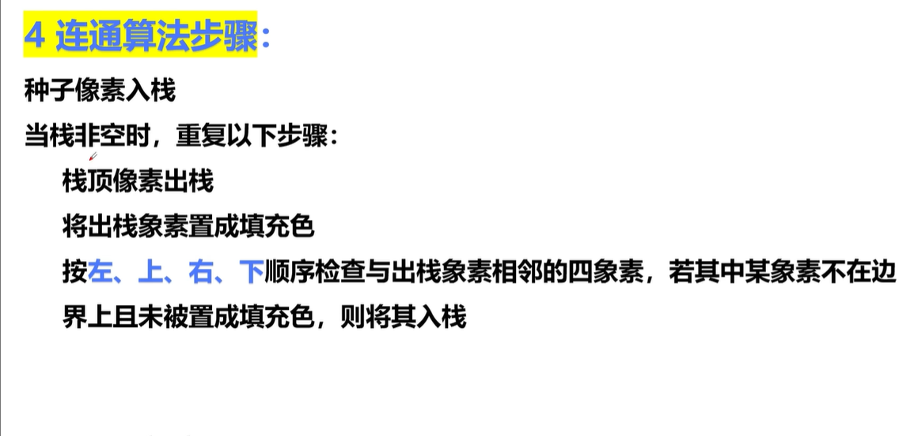
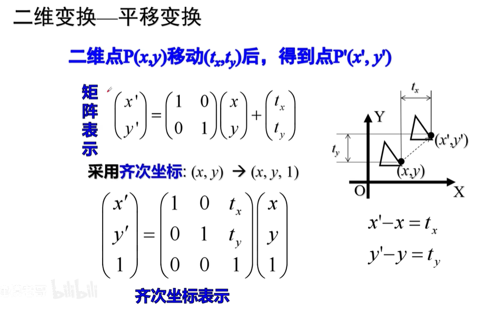
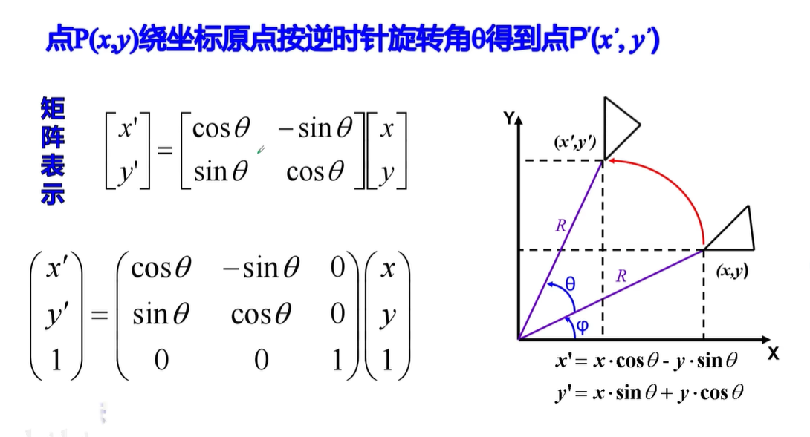
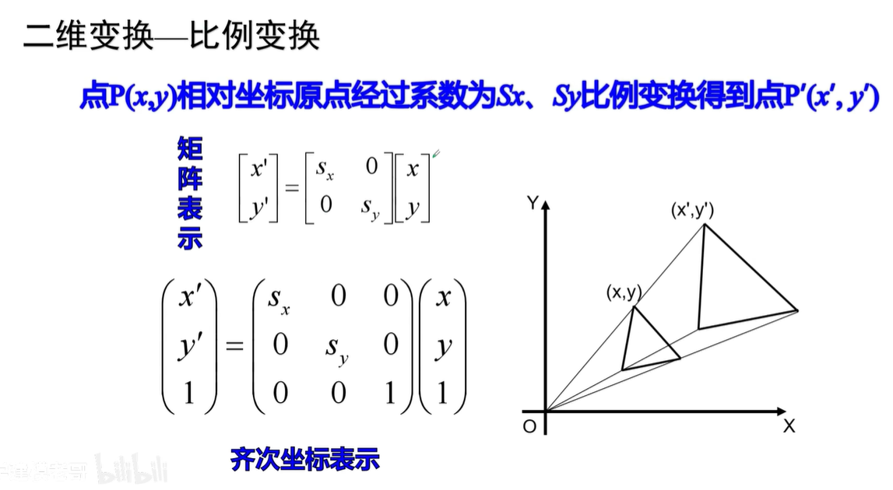
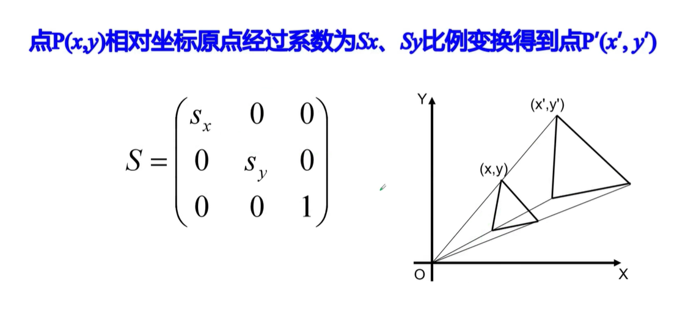
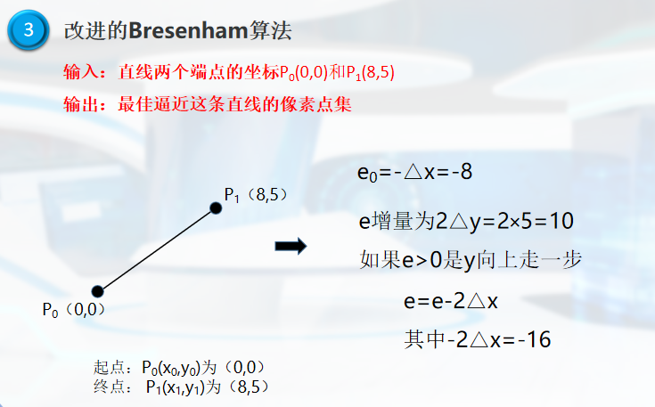
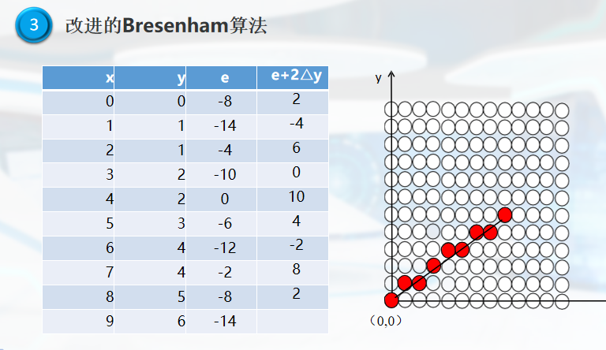
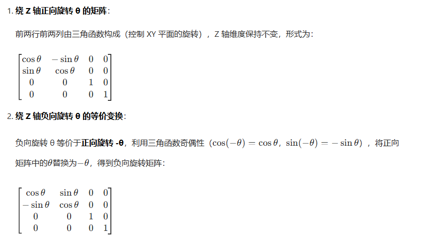

<!-- toc -->

[TOC]

# 裁剪算法

## cohen_sutherland算法

## Liang_Barsky算法

## 题目

# 光栅图形学算法

## DDA-Digital Differential Analyzer

## Bresenham算法

## 圆弧生成算法

## 区域的填充

## 种子填充算法

## 几何变换

### 平移变换

### 旋转变换

### 比列变换

### 对称变换

### 错切变换

## 题目

