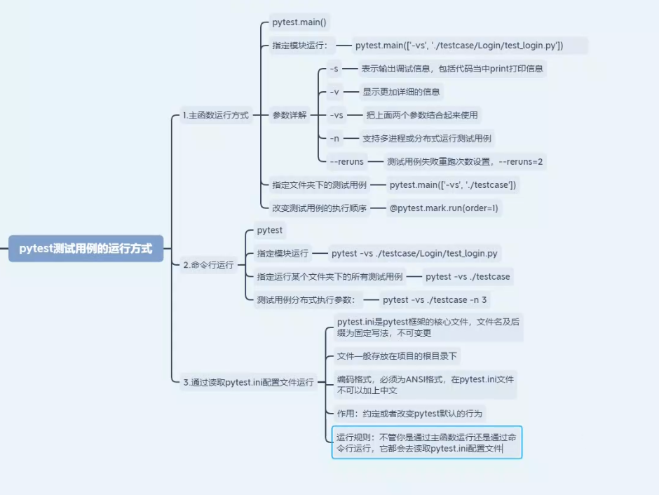
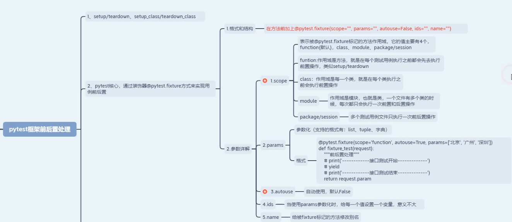
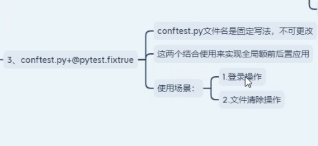
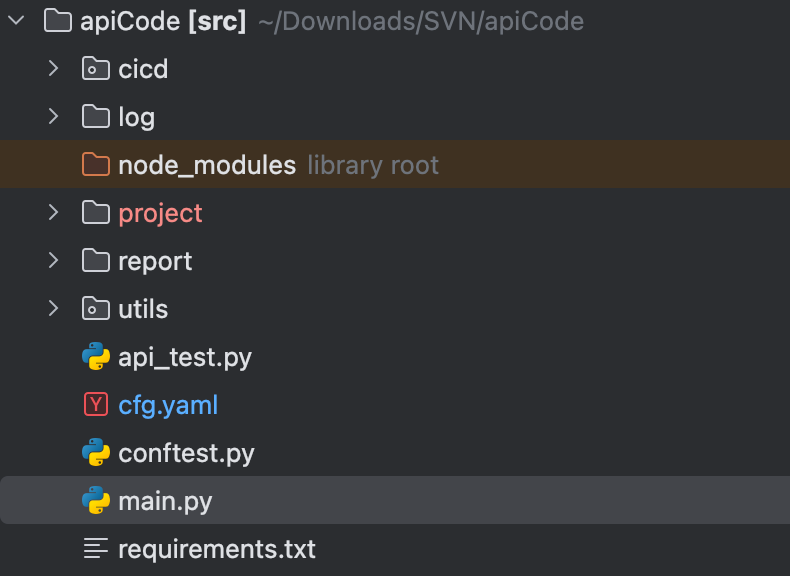

<!-- toc -->

[TOC]

## 测试用例的使用规则以及基础使用

- 模块名称必须以test_开头或以 _test结尾
- 测试了必须以Test开头，并且不能有init方法
- 测试方法必须以test开头

## pytest.ini



## 框架前后置处理





# 企业级框架学习

## 项目结构



## 功能详解：

本项目是一个基于Python的API自动化框架，它从XMind文件加载测试用例，通过执行它们的pytest，生产Allure报告

### main.py

**执行入口**
该文件负责清理旧报告、运行`pytest`并生成/展示Allure 结果。在`run()`函数中删除旧`report`目录后调用`pytest.main()`执行测试，再根据环境变量决定是否启动`allure serve`

### api_test.py

**单个测试函数**

定义了测试`test_unit_api` ，从夹具`cases_unit`获取用例。如果用例是`CaseFunc`类型则调用`BaseReq.req_func`，否则调用`BaseReq.req`处理接口请求

### conftest.py

**Pytest夹具与统计**

维护测试统计字典`test_statistics`，并在`pytest_runtest_makereporrt`钩子中统计通过/失败/跳过数量

`cases_unit`夹具负责读取并返回用例数据；`setups`夹具在会话级别完成设备连接及资源清理。钩子函数末尾再次记录测试执行情况

### cicd/result_processing.py

**结果整理**

从`conftest`获取`test_statistics`,生成包含总数，通过，跳过的字典并写入`result.txt`.同时提供读取，更新文件的函数

### utils/__ init __ .py

**公共工具**

- `get_logger`:配置`loguru`日志并同时向标准`logging`传递
- `Driver`统一初始化MySql，MongoDB，Redis，SSH，Kafka等连接
- `xrender`/`xrender_list`:递归替换用例参数中的变量
- `allure_step`等方法封装了Allure步骤与附件

### utils/base.py

**请求执行核心**

`BaseReq`类维护会话，数据连接及标签控制等信息，在`__init__`中读取配置并初始化Driver`req()`方法根据用例数据构造请求，包含token处理，文件上传下载，变量渲染，断言及灰/白/黑名单控制等逻辑

### utils/loader.py

**配置与用例解析**

负责读取`cfg.yaml`，根据配置加载XMind用例，处理环境信息，标签及端口映射，并将用例转换为`CaseFunc/CaseStep`对象。字符串和列表的变量替换也在此完成

### utilsdatabase.py

**数据库封装**

实现了 `MysqlDB`、`MongoDB`、`RedisDB` 三类数据库连接及基本操作，可通过跳板机方式连接 MySQL

### utils/server_op.py

**服务器和Kafka操作**

`ServerOp` 提供 SSH 执行命令、文件下载等功能；`KafkaRunner` 封装了生产/消费消息的逻辑

### 配置文件cfg.yaml

**运行及路径设置**

包含测试项目及报告路径等配置信息，在 `DataLoad.get_config()` 中读取

## 项目实际运行逻辑

执行入口（pytest.main） 
   ⬇
调用 test_unit_api 函数（pytest自动识别）
   ⬇
由 pytest fixture 注入用例数据（cases_unit）和初始化资源（setups）
   ⬇
调用 BaseReq.req 或 req_func 执行请求
   ⬇
收集并统计测试执行状态
   ⬇
结束后生成统计信息、报告

## **对collect_api详解**

测试用例项目配置加载，解析相关函数，用于从XMind文件，配置文件等读取测试项目等各种环境，用例，参数等配置。

- 函数声明与整体结构

```python
def collect_api(cls, mode: str) -> list:
    """
    读取项目配置，组装 api，cfg.run 字段配置读取项目路径
    :return: list
    """
    unit_run_dict = {}

```

创建 `unit_run_dict` 用于存放主项目下需要执行的用例集合。

- 函数定义与入参处理

```python
def collect(item, main=True):
    if isinstance(item, str):
        item = {item: 'main'}
```

1. `collect_api` 内部定义 `collect()` 用于读取单个项目的配置。
2. 如果 `item` 是字符串，则视为 `{项目名: 'main'}`


- 项目路径与初始化相关

```python
 # 暂时使用单个配置读取方式
    # project_path = f'project/{item}'
    ev_list = {}
    for pro, bc in item.items():
        branch = bc
        if not main:
            if isinstance(bc, dict):
                for kk, vv in bc.items():
                    branch = kk
                    ev_list = vv
        project_path = f'project/{pro}/{branch}'
        if main:
            GCache.set({'p_path': project_path})
        cls.project_name = pro
    api_path = f'{project_path}/api'
    
```

1. 遍历字典`item`，`pro` 为项目名，`branch`为分支，
2. 若 `main=False` 且 `bc` 为字典，说明是依赖项目，此时读取其分支名和环境变量映射 `ev_list`。
3. 根据项目名和分支拼接出项目目录`project_path`，主项目写入`GCache`
4. 记录当前处理的项目名到`cls.project_name`
5. 构造`api`子目录路径


- 解析`main.xmind`

  ```python
  try:
      x = xmindparser.xmind_to_dict(f'{project_path}/main.xmind')
      content = x
      for item in x:
          if item['title'] == 'SETTING':
              setting_data = item['topic']
          elif item['title'] == 'VARS':
              vars_data = item['topic']
  except Exception as e:
      raise Exception(f'\n项目{item}配置读取失败{e}，请检查main.xmind文件')
  ```

  1. 使用`xmindparser`读取`main.xmind`并转为字典
  2. `SETTING`为项目配置，配置所用的服务器和测试用例
  3. `VARS`为自定义变量

  


- 初始化配置变量

```python
setting = {}
run_env = None
```

`setting` 保存该项目的所有配置选项。

`run_env` 表示运行的环境名称（如 SIT、UAT 等）。

- 读取SETTING页信息

  ```python
  for st in setting_data['topics']:
      name = st['title']
      if name == '环境配置':
          if 'env' in os.environ:
              run_env = os.environ['env']
          for env in st['topics']:
              if run_env:
                  if env['title'] == run_env:
                      setting.update({'env': xtodict(env)[run_env]})
                      GCache.setting.update({'host': setting['env']['server']})
              else:
                  if 'makers' in env:
                      if 'task-done' in env['makers']:
                          run_env = env['title']
                          setting.update({'env': xtodict(env)[run_env]})
                          GCache.setting.update({'host': setting['env']['server']})
                          break
          if main:
              cls.env = run_env
          else:
              run_env = cls.env
  ```

  遍历 `SETTING` 页的各节点，根据节点标题判断含义。

  “环境配置”：

  - 如果环境变量 `env` 已指定，直接使用；否则寻找带 “task-done” 标记的子节点作为默认环境。
  - `setting['env']` 记录该环境的配置（服务器、数据库等），并同步到 `GCache.setting`。
  - 主项目保存到 `cls.env`，否则从主项目继承。

  继续读取其他配置

  ```python
      elif name == '场景配置':
          if 'topics' in st:
              for sdata in st['topics']:
                  if 'makers' in sdata and 'task-done' in sdata['makers']:
                      setting.update({'suit': xtodict_li(sdata)})
                      break
      elif name == '标签配置':
          setting.update({'tag': xtodict_li(st)})
          if 'topics' in st:
              for tdata in st['topics']:
                  if tdata['title'] == 'greylist':
                      if 'topics' in tdata:
                          for g in tdata['topics']:
                              if 'makers' in g:
                                  if 'flag-gray' in g['makers'] or 'flag-dark-gray' in g['makers']:
                                      cls.tag_grey['da'].append(g['title'])
                                      continue
                              cls.tag_grey['ea'].append(g['title'])
      elif name == 'cicd':
          setting.update({'cicd': xtodict(st)[st['title']]})
      elif name == '请求头配置':
          setting.update({'headers': xtodict(st)[st['title']]})
      elif name == '令牌配置':
          setting.update({'token_cfg': xtodict(st)[st['title']]})
      elif name == '设备配置':
          setting.update({'device': xtodict(st)[st['title']]})
      elif name == '端口映射配置':
          setting.update({'port_mapping': xtodict(st, alt_list=True)[st['title']]})
          cls.port_mapping.update(setting['port_mapping'])
      elif name == '构建参数配置':
          setting.update({'ext_vars': xtodict(st, alt_list=True)[st['title']]})
      elif name == '设备控制机配置':
          if 'topics' in st:
              from utils.misc import mdvr_api_url
              utils.misc.mdvr_api_url = st['topics'][0]['title']
  ```

  - 场景配置” ：找到带 `task-done` 的场景节点并解析。
  - “标签配置” ：解析标签列表，灰名单节点下分为允许/禁止两组。
  - “cicd”等其他配置均用 `xtodict` 转换为字典。
  - 端口映射和构建参数也存入对应属性；端口映射同时更新到 `cls.port_mapping`。
  - “设备控制机配置” 将设备控制机地址写入 `utils.misc.mdvr_api_url`。

- 处理VARS页及环境变量

```python
var_dict_raw = xtodict(vars_data, True)
if 'vars' in setting['env']:
    var_dict_raw.update(setting['env']['vars'])
```

1. 使用`xtodict(...,escape=True)`解析变量列表
2. 若环境中还定义了变量，也并入`var_dict_raw`


```python
var_dict = {}
for k, v in var_dict_raw.items():
    if (v.startswith('"') and v.endswith('"')):
        v = cls.renew_str(v.strip('"'))
    elif v.startswith("'") and v.endswith("'"):
        v = cls.renew_str(v.strip("'"))
    else:
        v = eval(v)
    var_dict.update({k: v})
```

1. 如果变量值用双引号`"`包裹，其为显示字符串，去除外层引号后，进行变量/函数替换；
2. 否则用`eval`将表达式转成实际类型


- 决定需要加载的测试套件（suits）

```python
if 'scene' in os.environ and os.environ['scene'].upper() != 'NULL':
    scene = os.environ['scene']
    ...
    for stt in setting_data['topics']:
        if stt['title'] == '场景配置':
            ...
            if ss['title'] == scene:
                suits = xtodict_li(ss)
                cls.suit = suits
                setting.update({'suit': suits})
                break
```

1. 如果环境变量`scene`指定了场景名，按此加载；遍历“场景配置”寻找匹配名称
2. 找到后解析为`suits`列表，并记录到`cls.suit`


其余情况：

```python
elif 'suit' in os.environ:
    if main:
        suits = os.environ['suit'].split(',')
        cls.suit = suits
    else:
        suits = 'ALL'
elif 'suit' in setting:
    if main:
        suits = setting['suit']
        cls.suit = suits
    else:
        suits = 'ALL'
else:
    case_path = f'{project_path}/main.xmind'
```

若通过 `suit` 环境变量指定，主项目使用此列表，依赖项目全部加载。

如果在 `SETTING` 中配置了场景，同样主项目使用该配置。

若都没有指定，则默认只读 `main.xmind`。

- 生成每个用例文件的路径列表

```python
if locals().get("suits") or locals().get('scene'):
    case_path = []
    if isinstance(suits, str) or (isinstance(suits[0], str) and suits[0].upper()) == 'ALL':
        try:
            dirs = os.listdir(project_path)
            dirs.sort()
            logger.info(f'target suits load: all\ntarget dirs: {dirs}')
        except Exception as e:
            logger.info(f'\n项目{item}目录读取错误{e}')
            return
        for i in dirs:
            if os.path.splitext(i)[1] == ".xmind" and not re.match('(?i)~\\$', i):
                case_path.append("/".join([project_path, i]))
    else:
        for i in suits:
            if isinstance(i, str):
                case_path.append(f'{project_path}/{i}.xmind')
            elif isinstance(i, dict):
                if cls.project_name in cls.sheet_mapping:
                    cls.sheet_mapping[cls.project_name].update(i)
                else:
                    cls.sheet_mapping.update({cls.project_name: i})
                for k, v in i.items():
                    case_path.append(f'{project_path}/{k}.xmind')
            elif isinstance(i, list):
                for ii in i:
                    case_path.append(f'{project_path}/{ii}.xmind')
    logger.info(f'target case paths: {case_path}')
    if not case_path:
        logger.error(project_path)
        raise Exception(f'{project_path} 未找到用例文件，初始化失败')
```

1. 若确定了`suits`，构造用例文件路径列表
2. 当`suits`指向`‘ALL’`时遍历整个目录加载所有的`.xmind`文件；否则按名称拼接
3. 如果`suits`中含有字典，则说明指定了需要读取的sheet名称，写入`cls.sheet_mapping`
4. 若没有找到任何文件则抛出异常

- 处理标签配置

```python
if 'tag' in os.environ:
    if os.environ['tag']:
        tags_env = os.environ['tag'].split(',')
        for i in tags_env:
            cls.tag[i] = []
            if f'tag_{i}' in os.environ and os.environ[f'tag_{i}']:
                for ii in os.environ[f'tag_{i}'].split(','):
                    cls.tag[i].append(ii)
elif 'tag' in setting:
    if main:
        for i in setting['tag']:
            cls.tag.update(i)
```

1. 运行时可通过`tag`环境变量覆盖`SETTING`中的标签
2. 如果环境变量未定义，则使用配置文件里的标签

- 读取公共配置与环境变量

```python
try:
    cls.project_header = {}
    if 'headers' in setting:
        cls.project_header = setting['headers']
    token_cfg = setting['token_cfg']
    device = {}
    if 'device' in setting:
        device.update(setting['device'])
except Exception as e:
    raise Exception(f'{project_path}公共配置读取错误，请检查setting配置项: {e}')
```

获取请求头，token，设备等信息。若缺失则抛出异常

接着读取环境配置

```python
if 'env' in setting:
    try:
        env_setting = setting['env']
    except Exception as e:
        raise Exception(f'{run_env}环境配置未找到，请检查setting-env配置项: {e}')
    try:
        server = env_setting['server']
        web_host = None
        if 'web' in env_setting:
            web_host = env_setting['web']
        if 'host' in os.environ:
            if main:
                if os.environ['host'] is not None and os.environ['host'].upper() != 'NULL':
                    server = os.environ['host']
            else:
                if 'host' in ev_list:
                    if os.environ[ev_list['host']] is not None and os.environ[ev_list['host']].upper() != 'NULL':
                        server = os.environ[ev_list['host']]
        if 'web' in os.environ:
            if os.environ['web'] is not None and os.environ['web'].upper() != 'NULL':
                web_host = os.environ['web']
    except Exception as e:
        raise Exception(f'{project_path}环境配置{run_env}读取错误，请检查setting-env配置项: {e}')
```

1. 读取服务器地址，web地址等。环境变量可覆盖配置文件
2. 若出现错误抛出异常

然后依次尝试获取更多可选配置（HTTP 端口、端口映射、SSH、MySQL、Mongo、Redis、设备、Kafka、CI/CD等），若缺失则记录日志并设置为 `None`。

- 处理Jenkins构建参数覆盖

```python
if 'ext_vars' in setting and main:
    ext_vars = setting['ext_vars']
    if ext_vars:
        for vbuild, vllist in ext_vars.items():
            if vbuild in os.environ:
                if os.environ[vbuild] is not None and os.environ[vbuild].upper() != 'NULL':
                    for vlocal in vllist:
                        cls.environ_vars_dict.update({vlocal: os.environ[vbuild]})
                        logger.debug(f'构建参数覆盖: {vbuild} = {os.environ[vbuild]}')
                    if 'taskCode' in vbuild:
                        cls.taskCode = os.environ['taskCode']
                    else:
                        cls.taskCode = 'auto_test_0'
                else:
                    logger.debug(f'构建参数覆盖: {vbuild} 未读取到对应环境变量')
else:
    ext_vars = None
```

1. 若`SETTING`中配置了构建参数映射（`ext_vars`），主项目会根据环境变量将其覆盖到内部变量字典，并记录
2. `taskCode`特殊处理：若映射项包含该字段就更新全局的`taskCode`

- 整理端口映射及服务器地址

```python
if cls.port_mapping:
    for mk, mv in cls.port_mapping.items():
        m_list = [u for u in mv if u]
        cls.mapping_list += m_list

if not server.endswith('/'):
    server += '/'
protocol = re_extract(server, "protocol")
host = re_extract(server, "host")
port = re_extract(server, "port")
cls.server = server
```

1. `cls.port_mapping` 中保存着端口到接口路径的映射；这里把所有映射的接口路径汇总到 `cls.mapping_list`。
2. 规范化服务器地址，以 `/` 结尾；并通过 `re_extract` 获取协议、主机名和端口。


- 处理变量字典

```python
for k, v in var_dict.items():
    if re.match('^\$', k):
        t_vname = k.strip('$')
        try:
            for t_cid, v1 in v.items():
                if isinstance(v1, str):
                    if t_cid not in cls.var_response_set:
                        cls.var_response_set.update({t_cid: {t_vname: v1}})
                    else:
                        cls.var_response_set[t_cid].update({t_vname: v1})
                else:
                    for get_type, get_path in v1.items():
                        if get_type == 'headers':
                            if t_cid not in cls.var_header_set:
                                cls.var_header_set.update({t_cid: {t_vname: get_path}})
                            else:
                                cls.var_header_set[t_cid].update({t_vname: get_path})
                        elif get_type == 'response':
                            if t_cid not in cls.var_response_set:
                                cls.var_response_set.update({t_cid: {t_vname: get_path}})
                            else:
                                cls.var_response_set[t_cid].update({t_vname: get_path})
        except Exception as e:
            raise TypeError(f'参数提取配置{k}错误{e}，数据类型应为dict')
    else:
        tmpargs = cls.renew({k: v})
        var_dict.update(tmpargs)
cls.var_dict.update(var_dict)
cls.var_dict.update(cls.environ_vars_dict)
```

1. 变量名称以`$`开头的被视为“从响应或头信息提取”的配置
   - `var_response_set`/`var_header_set`记录提取规则：{用例ID：{变量名：路径或表达式}}
2. 普通变量则直接进行替换（`renew`）后召回
3. 最终合并到`cls.var_dicr`，同时将构建参数覆盖（`environ.vars_dict`）加入

- 构建`cfg_dict`和`project_dict`

```python
cls.cfg_dict.update({
    pro: {
        "project": os.path.join(pro, branch),
        "mysql": mysql,
        "mongo": mongo,
        "redis": redis,
        "ssh": ssh,
        "host": server,
        "token": token_cfg,
        "device": device,
        "web": web_host,
        "kafka": kafka,
        "cicd": cicd
    }
})
if main:
    cls.cfg_dict.update({'main': pro})
GCache.set({'all_setting': cls.cfg_dict})
GCache.setting.update(cls.cfg_dict[cls.project_name])
cls.project_dict.update({cls.project_name: {'case_path': case_path, 'run_mode': {'unit': 1}, 'main': main}})
```

1. 汇总本项目的所有配置到`cls.cfg_dict`
2. 如果是主项目，再存一个`main`标记
3. 设置到`GCache`供其他模块访问
4. 记录该项目对应的用例路径和运行模式到`cls.project_dict`


- 结束`collect()`内部函数

`collect()`函数到此结束，剩余注释到`.svn`过滤没有启用

- 加载项目与用例

```python
def load_unit_cases(project, data):
    case_path = data['case_path']
    run_mode = data['run_mode']
    main = data['main']
    unit_dict = cls.read_testcase_unit(case_path)
    try:
        cls.unit_data_dict.update(unit_dict)
    except Exception as e:
        logger.info(f'\n项目{project}单元用例载入错误{e}')
    if run_mode['unit'] == 1 and main:
        unit_run_dict.update(unit_dict)

```

1. `load_unit_cases()`为每个项目解析用例文件并合并到全局字典
2. 主项目的用例另存入`unit_run_dict`用于返回

- 执行流程

```python
if not cls.api_dict:
    for item in cls.run_list:
        collect(item)
if cls.project_dict:
    if not cls.unit_data_dict:
        for k, v in cls.project_dict.items():
            load_unit_cases(k, v)
```

1. 若尚未解析过项目，遍历`run_list` 调用`collect()`
2. 然后根据`project_dict`加载各项目的用例

- 准备返回结果并写入环境文件

```python
out_res = ["empty"]
if unit_run_dict:
    out_res = unit_run_dict.values()

if os.path.exists(rf'allure-report{cls.sp}data'):
    env_path = f'allure-report{cls.sp}data{cls.sp}environment.properties'
else:
    if not os.path.exists(rf'report{cls.sp}data'):
        os.mkdir(f'report')
        os.mkdir(f'report{cls.sp}data')
    env_path = f'report{cls.sp}data{cls.sp}environment.properties'
with open(env_path, 'w', encoding='utf-8') as env_data:
    env_data.write(f"environment={cls.env}\n"
                   f"testsuits={cls.suit}\n"
                   f"paths={cls.case_path}\n"
                   f"tags={cls.tag}\n"
                   f"buildoverwrite={cls.environ_vars_dict}\n"
                   )
return out_res
```

1. 默认返回`["empty"]`,若解析得到用例则返回主项目的用例集合
2. 根据目录存在情况确定`environment.properties`的写入位置（Allure报告使用）
3. 记录环境，场景，路径，标签，构建覆盖等信息
4. 最终返回待执行用例的列表

总结整体流程：

遍历配置→解析XMind→读取环境，场景，标签与变量→生成用例路径→处理公共及环境配置→保存至全局缓存与属性→返回要执行的用例列表并生成Allure的环境说明文件

