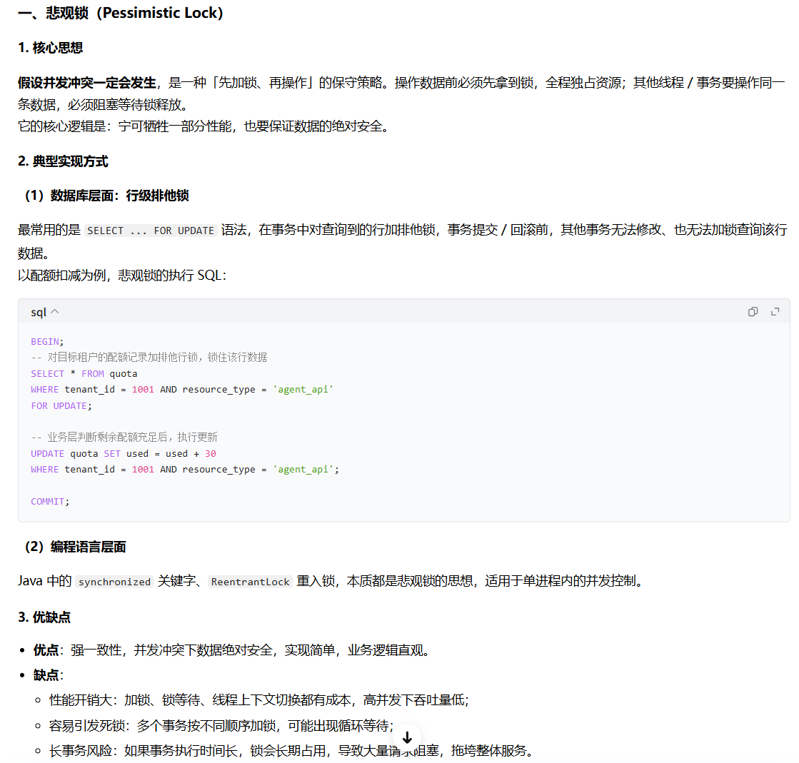
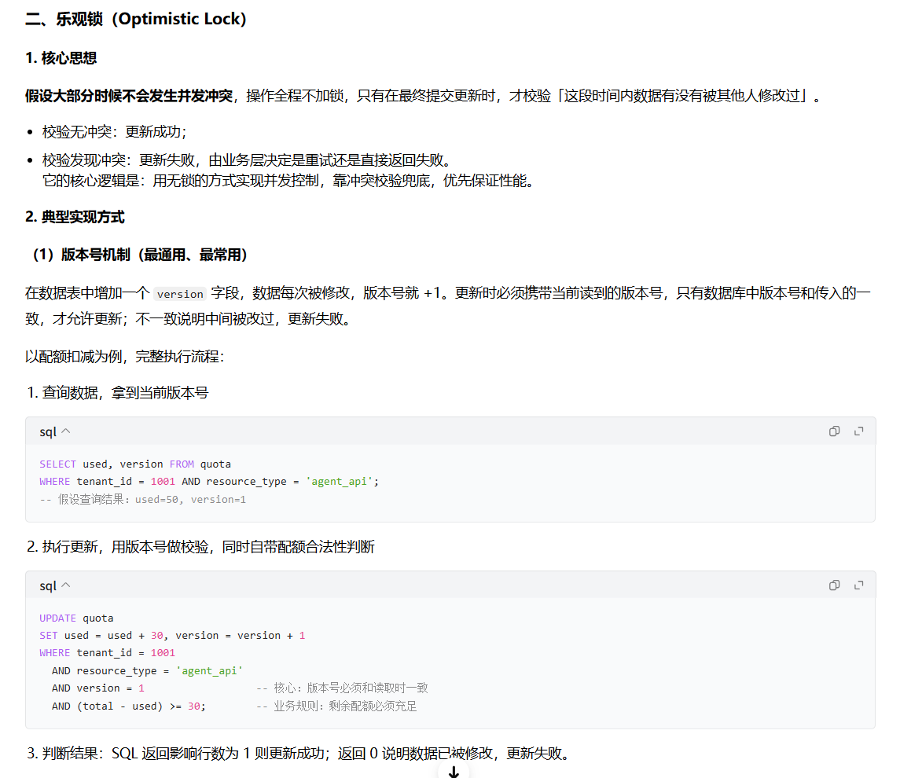
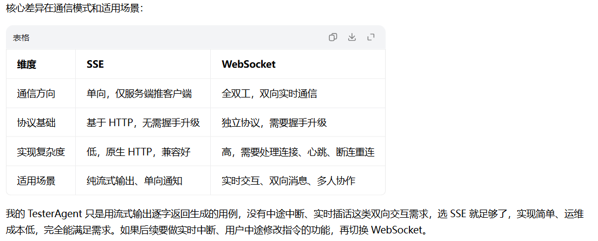

<!-- toc -->

[TOC]
# 面试自我开场白

面试官您好，我叫**，是**届本科生，目前应聘测开 / Agent 评测方向实习生，可一周内到岗，保证 6 个月以上实习时长。

我有两段测试相关实习经历：此前在**参与云平台项目的全流程质量保障；今年上半年在**企业应用部实习，核心负责 Agent 专属资源管理中台的测试工作，深度覆盖配额管控、多租户权限隔离等核心业务场景。

技术上我熟悉 Java/Python 双栈，掌握接口自动化、Web 自动化与 Jenkins CI/CD 流水线搭建；同时有从 0 到 1 搭建多 Agent 测试工具的项目经验，对 Agent 产品的测试方法论和评测体系有落地实践思考。希望能加入团队贡献相关经验。

# Agent 资源管理平台 标准化表述

#### 1. 平台职能

这是面向公司内部全业务线的企业级 Agent 资源管控中台，核心定位是统一管理 Agent 相关的算力配额、接口权限、账号资源，覆盖从申请、审批、分配到回收的全生命周期；解决各业务线资源分散管理、成本不可控、权限合规风险高的问题，是公司内部 Agent 业务落地的基础支撑平台。

#### 2. 个人负责内容

我全程参与平台从需求评审、用例设计到测试执行、上线回归的全流程质量保障：

- 核心负责五大业务场景的测试验证：Agent 资源申请审批、配额管控、资源分配与回收、多租户权限隔离、资源占用统计；
- 累计设计输出测试用例 400 余条，覆盖功能、边界、权限、异常等多类场景，重点攻坚多租户权限隔离与并发配额管控两大专项；
- 全链路跟进缺陷管理，从问题复现、根因定位到推动修复、回归验证，保障版本平稳上线。

#### 3. 实习产出成果

- 缺陷产出：累计提交有效业务缺陷 120 余个，推动修复高优先级缺陷 15 个，其中包含并发配额超发、横向越权等多个中高危业务逻辑漏洞；
- 流程能力：可独立完成从需求分析、核心测试点提取到测试执行的完整闭环，单份 PRD 可精准提取 20 个以上关键测试点；
- 认知沉淀：沉淀了企业级中台权限隔离、并发边界的专项测试思路，建立了对 Agent 类中台产品的业务质量管控体系认知。

## 实习经历深挖： Agent 资源管理平台测试

这是面试官的核心考察板块，重点验证你对 Agent 业务的理解、测试设计能力、缺陷推动能力与质量意识。

### 1. 请你介绍下 Agent 资源管理平台的核心定位，以及你负责测试的核心业务场景

**参考答案**： 这个平台是面向公司内部多业务线的 Agent 资源统一管理中台，核心解决不同团队 Agent 算力、接口权限、账号配额分散管理的问题，实现 Agent 资源的全生命周期管控。 我负责测试的核心场景覆盖五大模块：

- Agent 资源申请审批全链路：从租户提交申请、多级审批到资源正式下发的流程校验
- 配额管控：单租户、单 Agent 的资源额度限制、超额拦截逻辑验证
- 资源分配与回收：手动 / 自动资源分配、到期自动回收、状态流转一致性校验
- 多租户权限隔离：不同租户、不同角色的数据可见性与操作权限校验
- 资源占用统计：用量数据、配额使用率报表的准确性、时效性验证

### 2. 你重点做了多租户权限隔离测试，具体是怎么设计这部分用例的？有没有发现过典型的越权缺陷

**参考答案**： 我是从「角色维度 + 数据范围 + 操作类型」三个维度正交拆解来设计用例的。 首先梳理平台完整角色体系：超级管理员、租户管理员、普通开发者、只读用户；再明确数据范围：本租户数据、其他租户数据、全局公共配置；最后对应操作类型：查看、编辑、删除、审批、导出。通过组合覆盖所有高风险场景，比如普通开发者查看其他租户申请单、租户管理员修改全局配额等。 测试中确实发现了一个中高危横向越权缺陷：租户管理员调用资源详情接口时，通过修改请求体中的租户 ID 参数，就能越权查询其他租户的配额明细与使用数据。我通过 Charles 抓包复现后提交了高优先级缺陷，同步补充了全量接口的横向、纵向越权用例，最终推动开发在接口层增加了租户身份强校验，修复后全量回归通过。

### 3. 你在这个平台累计提交 120 + 缺陷，其中高优先级 15+，举一个印象最深的高优缺陷，讲讲从发现到闭环的完整过程

### 并发配额超发缺陷全链路详解

我印象最深的是**Agent 资源配额并发超发**的高优先级业务逻辑缺陷，整个过程从测试设计、发现定位、方案评审到验证闭环，我全程深度参与，也对分布式系统的资源类测试有了很落地的认知。

#### 1. 缺陷背景与风险定级

这个缺陷出现在 Agent 资源管理平台的**配额管控模块**。平台里的配额对应的是真实的算力资源、接口调用额度，每个租户的总配额是提前规划好的，一旦超发就意味着实际资源占用超过了分配额度，直接造成公司算力成本失控；如果多租户大面积出现，甚至会导致底层资源池透支，影响全公司的 Agent 业务，所以我们定级为 P0 级高优缺陷。

当时我正在做配额模块的边界与异常专项测试，没有只停留在 “单条申请、数值边界” 的常规场景，而是按照分布式系统的测试思路，额外扩展了**时序与并发维度**的测试点 —— 因为只要涉及 “读数据→做判断→写数据” 的资源扣减链路，并发就是天然的高风险点。

#### 2. 场景设计与复现过程

我设计的测试场景很典型：

- 预设条件：某租户的某类 Agent 资源，总配额 100 单位，已使用 50 单位，剩余可用 50 单位。
- 构造两份独立的资源申请单，每份申请额度都是 30 单位。单看每一份，30<50，都符合剩余配额要求，单独提交都会正常通过。
- 测试操作：通过 Python 多线程脚本，让两份申请的「审批通过」接口在同一时刻并发请求，模拟两个管理员同时审批、或者前端重复提交导致的并发场景。

复现结果完全符合我的预判： 两个审批请求都返回了 “审批通过、资源下发成功”，但去数据库查配额数据时，已用额度从 50 变成了 110，超过了 100 的总配额上限；同时对应的资源实例也成功创建了两份，相当于租户超额拿到了 10 单位的资源。我同步用 Charles 抓包确认了两个请求几乎同时到达服务端，排除了操作时序的干扰，确认是并发场景下的逻辑漏洞。

发现问题后，我在缺陷单里附上了：稳定复现的脚本步骤、抓包的请求时序截图、数据库前后数据对比、以及明确的业务风险说明，当天就推动开发拉了专项评审。

#### 3. 根因定位

和开发一起排查后，确认根因是**经典的 “读 - 改 - 写” 非原子操作问题**： 原来的审批扣减逻辑是三步串行：

1. 查询数据库，获取当前租户的剩余配额；
2. 业务层判断：申请额度 ≤ 剩余配额，则校验通过；
3. 执行更新语句，把已用配额加上申请额度。

这三步是完全分开的，没有任何并发保护。并发场景下，两个请求同时读到剩余 50 的结果，都判断校验通过，然后各自执行更新操作，后执行的更新会覆盖先执行的结果，最终只累加了一次申请额度的增量，导致总配额超发。

#### 4. 修复方案的讨论与优化

开发最初的方案是直接在数据库层面加行锁，用 `select ... for update` 把查询和更新锁住，保证串行执行。 我当时提出了补充建议：只加数据库行锁能解决原子性问题，但业务体验和性能上还有优化空间，建议做成**“申请预校验 + 审批原子扣减” 的双重防护**：

- 第一层：申请提交阶段就做预校验，先拦截明显超额的申请，避免大量无效申请流转到审批环节才被打回，既提升用户体验，也减少最终扣减环节的并发冲突；
- 第二层：审批通过的最终扣减环节，不用悲观行锁，改用**数据库乐观锁（版本号机制）**实现原子性。更新 SQL 写成： `update quota set used = used + apply_amount, version = version + 1 where tenant_id = ? and resource_type = ? and version = ? and (total - used) >= apply_amount` 通过返回的影响行数判断是否扣减成功，失败则直接返回 “配额不足”。 相比悲观行锁，乐观锁在并发冲突不高的业务场景下，性能开销更小，也不会出现长事务锁表的风险。

最终开发采纳了这个双重校验的方案，用乐观锁做核心原子保障，申请层加预校验做前置拦截。

#### 5. 全量验证与缺陷闭环

修复上线前，我没有只测 “单条申请正常、超额申请拦截” 的基础场景，而是做了四个层级的全量回归验证：

1. **基础功能回归**：单线程下正常申请、刚好等于剩余配额、超额申请，验证基础逻辑正确，提示文案清晰；
2. **并发场景回归**：从 10 线程低并发到 100 线程峰值并发，持续压测 5 分钟，全程监控配额数值，验证无论并发多高，总配额始终不会超发，同时统计拦截成功率；
3. **边界极端场景**：剩余配额刚好等于 1 份申请额度时并发两份、同租户同时提交多份不同额度的申请，验证极端边界下逻辑正确；
4. **数据一致性校验**：并发测试后，核对配额表、资源实例表、审批单表三表数据一致，没有出现 “审批成功但配额没扣”“配额扣了但资源没创建” 的脏数据。

所有场景全部通过后，才关闭了这个缺陷，最终平台上线后没有再出现过配额超发的问题。

#### 6. 后续沉淀

缺陷闭环后，我做了两个沉淀动作：

- 把 “并发资源扣减” 这类场景，整理成了配额、库存、额度类模块的通用测试用例，纳入团队的用例库，后续同类需求默认覆盖；
- 输出了一份分布式系统资源类场景的测试 Checklist，包含并发、时序、异常中断三个维度的通用测试点，同步给了组里的测试同学

### 4. 在 Agent 资源配额管控场景中，你设计了哪些典型的边界测试用例

**参考答案**： 我主要从数值、状态、时间三个边界维度设计：

- **数值边界**：配额刚好等于申请值、配额比申请值少 1、配额为 0、配额为负数、配额达到系统上限，验证拦截逻辑与提示的准确性
- **状态边界**：配额仅剩 1 个单位时提交申请、资源正在回收中再次申请同类型资源、租户被禁用后配额是否同步冻结，验证状态流转中的配额计算准确性
- **时间边界**：资源到期当日 0 点是否自动回收、到期前 1 小时续期是否生效、跨月配额统计是否准确，验证时间节点的逻辑正确性 其中就通过时间边界用例，发现了「到期时间与审批通过时间为同一时刻时，资源先被回收又被下发」的状态异常问题。

### 5. 这个 Agent 平台上线前，你是怎么评估整体上线质量、做风险管控的

**参考答案**： 我主要从三个维度完成上线质量评估与风险兜底：

1. **用例与缺陷维度**：核心业务场景用例执行率 100%，P0/P1 级缺陷全部清零；遗留低优先级缺陷全部和产品、开发同步风险，确认不影响核心流程，排入后续迭代
2. **专项验证维度**：权限隔离、并发、边界等高风险专项全部完成回归，同时在灰度环境用内部测试租户跑了 3 天真实业务流程，核心链路无异常
3. **上线兜底维度**：输出完整上线质量报告，包含测试范围、缺陷分布、遗留风险、上线 checklist；同步给运维提供了核心监控项（配额异常、接口报错率），并确认了回滚预案，保障上线后可快速响应问题

## Agent 架构与设计

1. 你的 TesterAgent 用了 LangGraph+DeepAgents 做多智能体，为什么不选择单 Agent 的 ReAct 范式？结合测试用例生成场景讲一下选型依据

   ​		测试用例生成是典型的多阶段、强分工场景，需要需求解析、行业调研、用例生成、合规评审多个独立环节，单 Agent 的 ReAct 范式很难兼顾质量和稳定性。

   

   - ReAct 的核心是「思考 - 行动 - 观察」单循环，适合目标开放、路径不确定的探索类任务，但它把所有能力耦合在一个 Agent 里，长任务下容易出现注意力漂移、前面的需求约束被遗忘的问题；而且所有步骤串行执行，效率低。
   - 多 Agent 架构的优势正好匹配这个场景：一是职责解耦，每个子 Agent 只专注单一任务，Prompt 更聚焦，输出质量更高；二是支持并行执行，比如需求解析完成后，调研补全和初步用例生成可以同时跑，耗时缩短近 40%；三是可维护性强，某个环节优化不会影响其他模块，比如优化评审逻辑不用改动生成 Agent。
   - 最终选 LangGraph 而不是自研工作流，是因为它原生支持状态机、分支判断、循环重试、异常捕获，不用自己手写流程调度；而且和 LangChain 生态完全打通，工具接入、模型调用成本很低，能快速落地验证。

2. 你设计的多 Agent 具体是什么协作模式？Master-Slave 还是 Supervisor？有没有遇到过协作瓶颈？

   整体是「流水线调度 + 节点并行 + 终局评审」的混合架构，偏向 Supervisor 模式，而非简单的主从结构：

   1. 入口是需求解析 Agent，负责解析 PRD、提取结构化需求点，输出标准化状态，相当于流程起点；
   2. 中间层是并行执行节点，调研补全 Agent 和用例生成 Agent 同时执行，分别负责外部场景补充和基础用例输出；
   3. 最终是评审优化 Agent，相当于 Supervisor 角色，负责校验前序输出的完整性、正确性，识别矛盾和遗漏，不合格就打回对应节点重跑，合格就输出最终结果。

   - 遇到的核心瓶颈是**节点间信息传递偏差**：最开始用自然语言传递上下文，经常出现需求解析的约束传到生成 Agent 就丢了一半。
   - 解法是用 Pydantic 定义全局统一的 State 结构，所有节点的输入输出必须遵循固定 Schema，强制结构化传递；同时在 LangGraph 里加了状态校验节点，关键信息缺失直接触发补全，不会往下游传递脏数据。优化后需求点传递的准确率提升了 25%

   

3. 从测试视角看，的 Agent 资源管理平台核心架构是怎样的？你测试时会关注哪些架构层面的风险？

   从业务全链路来看，是典型的企业级中台分层架构：

   前端交互层  ->  业务服务层（申请，审批，配额，统计)  ->  核心能力层(权限中心，资源管控引擎，审批流引擎)  ->  底层资源池（算力配额，接口权限，账号资源）。同时对接HR系统，Datahub等上游业务系统

   1. **数据一致性风险**：分布式架构下，配额扣减、资源下发、权限开通是跨服务的，很容易出现部分成功部分失败，比如审批通过了但资源没下发，或者资源下发了配额没扣减。我会专门做异常断流测试，模拟中间节点失败，验证回滚、补偿机制是否生效。
   2. **多租户隔离风险**：架构上是逻辑隔离而非物理隔离，一旦租户 ID 校验漏了就会出现越权。我会从接口、数据、缓存三个层面全量验证隔离性，比如跨租户调用接口、查缓存会不会拿到别的租户数据。
   3. **并发下的架构缺陷**：比如配额校验和扣减是两个步骤，架构上没有做原子性保障，就会出现并发超发。这也是我当时发现的高优缺陷，本质就是架构设计的边界考虑不全。

4. Plan-and-Execute 和 ReAct 的核心区别是什么？如果把 TesterAgent 改成 Plan-and-Execute 架构，你会怎么设计

   核心区别在于决策模式：

   - ReAct 是**增量决策**，走一步想一步，每轮思考只决定下一步动作，适合路径高度不确定、需要动态调整的探索类任务，比如开源项目调研；缺点是容易走偏、全局把控弱。
   - Plan-and-Execute 是**分阶段决策**，先做完整全局规划，拆解成原子子任务，再批量执行，适合目标明确、流程相对固定的任务，优点是全局一致性强、不容易漏项，缺点是应对突发异常的灵活性弱。

   如果改成 Plan-and-Execute 架构，我会这么设计：

   1. 新增规划 Agent 作为首节点，解析 PRD 后直接输出完整的用例生成计划，拆解成功能用例、边界用例、权限用例、异常用例 4 类子任务，每个子任务标注输入、输出、依赖关系；
   2. 执行层按计划分发给不同的专用生成 Agent 并行执行，每个 Agent 只负责一类场景，Prompt 更精准；
   3. 最后汇总评审 Agent 做整合校验，和现有架构衔接。 相比现有方案，规划前置后需求遗漏率会更低，但对于模糊、不规范的 PRD，适配灵活性会差一些。

## 上下文与记忆工程

1. TesterAgent 支持用户多轮迭代修改用例，你是怎么做状态管理和记忆优化的？有没有遇到过长上下文遗忘问题？

   我没有直接把全量对话历史塞进上下文，而是用「结构化状态核心存储 + 分级记忆」的方案：

   - 核心记忆是 LangGraph 的全局 State，用 Pydantic 结构化存储，只保留 PRD 核心需求点、已生成用例清	单、用户修改意见、待办任务清单这些关键信息，完全不存冗余对话内容，从源头压缩上下文体积。	

   - 短期会话记忆存在服务内存中，只保留最近 3 轮的交互细节；超过 3 轮就自动做摘要，只保留关键变更点，更新到结构化 State 里。
   - 长上下文场景下，PRD 原文不全程携带，而是向量化后存在本地向量库，需要引用对应段落时再做召回，避免全量 PRD 占用 Token。

2. 如果给企业级 Agent 平台设计长短期记忆方案，Redis 和向量数据库分别适合存什么？多租户场景下要注意什么？

   两类存储适用场景完全不同，按数据特性和访问频率分工：

   - **Redis 适合存短期、高频、结构化的会话状态**：比如用户当前会话的操作上下文、临时任务进度、锁状态、热点配置。特点是读写延迟低、支持过期自动清理，天然适合会话级缓存。比如资源申请的中途操作状态、审批流的临时节点，都存在 Redis 里。
   - **向量数据库适合存长期、非结构化、需要语义召回的记忆**：比如租户的历史操作记录、Agent 历史执行轨迹、知识库文档。比如用户每次申请资源的偏好、历史问题排查记录，向量化后存起来，后续同类场景可以直接召回复用。同时结构化的元数据会同步存在 MySQL，用于精确过滤。

   多租户场景下的核心注意点是**严格的存储隔离**：

   - Redis 层面用「租户 ID: 业务 key」的前缀做隔离，禁止跨租户访问，同时权限层做二次校验；
   - 向量库层面按租户分 Collection，检索时强制带租户过滤条件，避免召回其他租户的敏感数据；
   - 这也是测试时的必测项：构造跨租户的查询请求，验证会不会拿到非授权数据。

3. 你提到用 Todo List 让模型聚焦，背后的原理是什么？为什么简单加个清单效果就很明显

​		本质是**引导大模型的注意力分配，缓解长上下文的注意力衰减问题**。 大模型的注意力资源是有限的，上下文越长，中间位置的信息权重越低，很容易被忽略；同时开放式任务下，模型没有明确的执行锚点，容易出现目标漂移，做着做着就偏离了原始需求。 Todo List 的作用有两个：

1. **注意力锚定**：把核心目标拆解成清晰的条目，放在上下文的显著位置，强制模型每一步输出都对齐清单，把分散的注意力收束到明确的任务点上；
2. **执行闭环校验**：模型可以通过核对清单，自我检查有没有遗漏项，相当于内置了一层轻量的自校验逻辑，减少漏项。 落地效果也很明显：对于 5 页以上的长 PRD，需求点漏项率下降了 30% 左右，是投入产出比很高的优化手段。

## 工具调用与规划

1. TesterAgent 里的搜索工具，Function Calling 的参数 Schema 是怎么设计的？怎么防止模型瞎编参数？

   全部用 Pydantic 定义严格的参数 Schema，从约束、校验、Prompt 三层做防护：

   1. Schema 设计层面：每个参数明确类型、必填 / 可选、取值范围、枚举值、业务含义描述。比如搜索工具定义：`query`（必填，str，最大长度 100）、`max_results`（可选，int，取值 1-10，默认 5）、`search_type`（可选，枚举值：general/tech）。能用枚举的绝对不用自由文本，能加范围的绝对不放开边界。
   2. 前置校验层面：工具调用前，会先用 Pydantic 做实例化校验，参数不合法直接抛出结构化错误，返回给模型让它修正后重试，不会把错误参数传给真实工具。
   3. Prompt 约束层面：系统提示词里明确要求必须严格遵循 Schema 传参，禁止编造不存在的参数，同时给出正确示例。 最开始没有前置校验，参数错误率大概有 15%，加了之后降到了 2% 以内，基本不会出现瞎编参数的问题。

2. 工具调用超时、失败或者返回异常结果时，你的 Agent 有什么重试和降级策略？

   按异常类型做分级处理，既保证成功率，也避免无限重试浪费成本：

   1. **参数错误类异常**：直接返回结构化的错误原因，让模型修正参数重试，最多重试 2 次；2 次都失败就跳过该工具，用现有信息继续任务，同时在结果中标注该工具未执行。
   2. **网络超时 / 服务不可用**：采用指数退避重试，第一次间隔 1s，第二次 3s，最多重试 3 次；连续失败则触发降级逻辑。比如搜索工具不可用时，降级为只基于 PRD 原文生成用例，同时在输出开头标注「未进行外部场景调研，边界覆盖可能不全」，让用户有预期。
   3. **返回结果为空 / 无意义**：让模型判断是否需要改写查询词重试，最多换词 1 次，还是无结果就放弃。 所有工具调用的入参、出参、异常、耗时都会完整记录到 Trace 日志里，一方面用于 bad case 定位，另一方面也是评测的核心指标（工具调用成功率）。

3. 你测试 Agent 资源平台的时候，怎么测内部接口 / 工具调用的异常场景？举个实际案例

   我主要通过断点模拟、依赖故障注入的方式测试，覆盖超时、错误返回、服务宕机三类场景：

   1. 用 Charles 做接口断点，修改返回状态码、篡改响应数据、模拟超时，验证前端提示是否友好、业务状态是否一致、会不会产生脏数据。
   2. 配合开发做依赖故障注入，比如模拟配额校验服务不可用，验证平台有没有熔断降级，会不会出现重复提交、资源超发。
   3. 并发场景下模拟接口延迟，验证状态流转的原子性。

   印象最深的案例：模拟审批流接口超时，前端显示审批失败，但后端实际已经审批通过，配额也扣减了，用户侧却看不到状态更新，属于典型的调用异常导致的数据不一致。定位后推动开发加了状态最终一致性校验，异步轮询审批结果，异常时自动同步状态，修复后全量回归了所有跨服务调用的场景。

## 工程与底层基础

1. 资源管理平台的核心数据存在 MySQL 里，按租户 ID + 时间查申请记录，怎么建索引最优？为什么？

   最优方案是建 `(tenant_id, create_time)` 的联合索引，原因是符合最左前缀匹配原则：

   1. 租户 ID 是查询的第一过滤条件，区分度极高，放在最左边可以快速过滤出目标租户的所有数据，大幅减少扫描行数；
   2. create_time 放在第二位，既可以满足按时间范围查询，也能支持按时间排序，避免 filesort 文件排序，提升查询效率；
   3. 如果查询还要带申请状态筛选，可以扩展成 `(tenant_id, status, create_time)`，仍然遵循最左前缀。

   测试时我也会关注慢查询，比如有些接口全表扫描，我会把慢 SQL 提出来，和开发确认索引是否合理，推动优化。

2. 并发场景下的配额超发问题，用 Redis 分布式锁怎么解决？有哪些注意点？

   核心是把「配额校验 + 扣减」的关键区段串行化，同时保证锁的安全性：

   1. **锁粒度设计**：锁的 key 为 `resource_quota:{tenant_id}:{resource_type}`，按租户 + 资源类型加锁，粒度足够细，不会造成全平台串行，兼顾并发性能。
   2. **加锁原子性**：用 `SET key value NX EX expire_time` 原子命令加锁，同时设置过期时间，避免服务宕机导致死锁。value 用唯一请求 ID，用于校验锁归属。
   3. **释放锁原子性**：用 Lua 脚本实现「判断锁是否属于当前请求 + 删除锁」的原子操作，防止业务执行超时、锁自动过期后，误删其他请求的锁。

   注意点：

   - 过期时间要合理，必须大于业务最长执行时间，避免业务没跑完锁就释放了；
   - 不能只靠分布式锁，数据库层还要加乐观锁（版本号）做兜底，双重保障，防止锁过期后的极端超发；
   - 要考虑锁获取失败的降级逻辑，是排队重试还是直接返回繁忙，不能无限阻塞。

3. Agent 流式输出用 SSE 和 WebSocket 有什么区别？你的项目选哪个更合适

   

## Agent 评测体系设计

1. 如果让你给的 Agent 资源管理平台搭建完整评测体系，按结果层、过程层、系统层展开讲

   - 这个平台以确定性业务操作为主，评测核心是「结果可闭环、过程可追溯、成本可管控」，严格按三层架构设计：

     #### 结果层：验证任务是否真正完成

     以规则断言和环境状态比对为核心，确定性场景 100% 不依赖模型裁判。

     - **确定性业务场景**（资源申请、配额调整、权限分配等）：做全链路状态断言。不仅校验接口返回成功，还要同步比对数据库配额表、资源实例表、权限中心数据，确保数据一致。比如审批通过后，必须验证：已用配额正确增加、资源实例已生成、对应租户权限已开通，三者全部符合预期才算通过，杜绝 “假成功”。
     - **轻量决策场景**（智能资源推荐、异常工单分类）：用规则做硬约束校验（比如推荐配额不能超上限），再用 LLM-as-Judge 从合理性、匹配度两个维度打分，人工抽检校准。

     #### 过程层：验证执行路径是否合理高效

     基于全链路 Trace 数据做过程评测，核心看三个指标：

     - **调用准确率**：接口 / 工具调用的参数是否正确、有没有漏调必要步骤、有没有多余的无效调用；
     - **路径高效性**：完成一个任务的步骤数、调用次数是不是最优，有没有绕路、重复执行、死循环；
     - **错误自愈能力**：遇到接口失败、参数错误时，有没有重试、降级、补偿机制，还是直接中断报错。 比如我当时发现的「审批驳回不回收预占配额」的缺陷，就是通过过程链路追踪发现的 —— 流程只走了驳回状态更新，漏掉了配额回收的步骤。

     #### 系统层：验证服务的成本与稳定性

     - **性能指标**：核心操作端到端时延、接口成功率、并发吞吐量、99 分位延迟，设定明确 SLA，比如资源申请 99% 请求 < 200ms，接口成功率 99.99%；
     - **稳定性指标**：72 小时长稳运行错误率、故障恢复时长、限流降级生效效果；
     - **资源成本**：服务器资源占用、下游算力消耗，多租户场景下还要验证性能隔离，避免单租户大流量影响全平台。

     最后形成闭环：每次迭代跑全量评测→输出评测报告→bad case 归因→推动优化→回归验证，持续迭代。

2. 针对你的 TesterAgent，又该怎么设计评测体系？同样按三层来讲

   TesterAgent 是生成式产品，结果层会兼顾硬规则指标和质量类指标，整体仍然遵循三层架构：

   #### 结果层：用例生成的质量与覆盖度

   分两类指标，硬指标用规则断言，软指标用模型 + 人工评测：

   - **规则可量化指标**：需求点覆盖率（人工标注 PRD 基准测试点，统计命中占比）、格式合规率（正则校验是否符合用例模板）、无效用例占比（完全偏离需求的用例比例）。这部分 100% 自动化，每次迭代必跑。
   - **质量类指标**：用 LLM-as-Judge 从准确性、完整性、可执行性、边界丰富度 4 个维度 1-10 分打分；同时人工抽检 10% 的核心样本，校准裁判模型偏差，避免误判。

   #### 过程层：Agent 执行链路的合理性

   基于 LangSmith 的 Trace 数据评测：

   - 规划合理性：子 Agent 执行顺序是否最优，有没有做无用的调研、重复生成；
   - 工具调用质量：搜索查询词是否相关、参数是否正确、无效调用占比；
   - 纠错能力：评审 Agent 能不能识别出生成的错误用例，用户修改时能不能精准改动对应部分、不影响其他正确内容。

   #### 系统层：成本与性能

   - **成本指标**：单份 PRD 的 Token 消耗量、大模型调用次数、工具调用次数，折算成单任务成本。这是企业落地的核心指标，我最初优化前单份 PRD 成本约 2 元，通过上下文压缩、工具调用优化后降到了 0.8 元。
   - **性能指标**：端到端生成时长、首条用例输出耗时、服务并发支持数、长时运行错误率。
   - **工程可维护性**：修改单个模块会不会引入整体回归，新增子 Agent 的接入成本。

## 评测难点与 Badcase 定位

### 1. Agent 评测结果不稳定，同一份输入两次跑结果不一样，怎么解决？如何保证可复现？

**参考答案**： 核心方案是**沙盒化评测环境**，消除所有变量干扰：

1. **固定输入与环境**：沉淀固定的评测数据集，每次评测都用完全相同的输入；评测前将代码、Prompt、依赖版本都锁定到同一快照，排除版本差异。
2. **消除模型随机性**：评测时将 temperature 设为 0，关闭采样，保证模型输出的稳定性。
3. **外部依赖 Mock**：搜索、第三方接口这类外部依赖，全部用固定的 Mock 返回值，避免外部数据变化影响评测结果。
4. **多轮取平均**：对于实在无法完全消除随机性的场景，同一样本跑 3 次取平均值，降低偶然波动。 通过这些手段，我项目里的评测结果复现率稳定在 95% 以上，能真实反映优化效果，不会出现 “这次好下次差” 的情况。

### 2. Agent 错误是层层传递的，你怎么定位 badcase 出在哪个环节？举个实际例子

**参考答案**： 核心方法是**模块化拆解 + 全链路 Trace 定位**，把 Agent 拆成独立模块做单元评测，精准定位根因，而不是笼统改 Prompt。 举个实际案例：有一份 HR 系统的 PRD，生成的用例完全漏掉了「管理员重置租户配额」的功能点。

1. 先查需求解析模块的输出：发现它正确提取了这个需求点，写入了结构化 State，排除解析环节问题；
2. 再查调研模块：它也针对这个点召回了相关测试场景，排除调研环节问题；
3. 再查用例生成模块的输入输出：State 里的需求点确实传进去了，但生成结果里没有，确认是生成环节长上下文注意力衰减导致的遗漏；
4. 最后查评审模块：它也没识别出这个遗漏，说明评审环节的校验逻辑有缺失。 最终定位根因是长上下文注意力衰减 + 评审校验不足。解法不是全量改 Prompt，而是优化 Todo List 机制，把需求清单放在生成 Prompt 最前面；同时给评审 Agent 加覆盖率自动校验，漏项自动补全。优化后这类漏项问题减少了 70%。

### 3. LLM-as-Judge 裁判不准，甚至被 Agent 输出 “欺骗”，怎么解决？

**参考答案**： 首先坚守一个原则：**能用规则断言的，绝对不用模型裁判**。模型裁判只负责处理开放式、主观性的质量维度，所有硬指标全部用规则兜底。 针对裁判不准的问题，有四层优化手段：

1. **多路交叉验证**：核心场景用 2-3 个不同能力的模型同时打分，取多数结果或平均分，降低单个模型的偏见；
2. **结构化评分 Prompt**：给裁判模型明确的评分标准、正反示例，强制它先列事实依据、再逐维度打分、最后给总分，用思维链引导减少主观误判；
3. **人工定期校准**：每个迭代人工抽检一批样本，和模型裁判结果对比，偏差超过阈值就优化裁判 Prompt，持续校准；
4. **反欺骗约束**：明确要求裁判模型必须对照原始需求和事实依据打分，不能只看输出的表述是否流畅。比如评测用例覆盖率，必须先列出所有需求点，再逐一核对是否覆盖，避免被 “看似全面” 的空话欺骗。

​		

